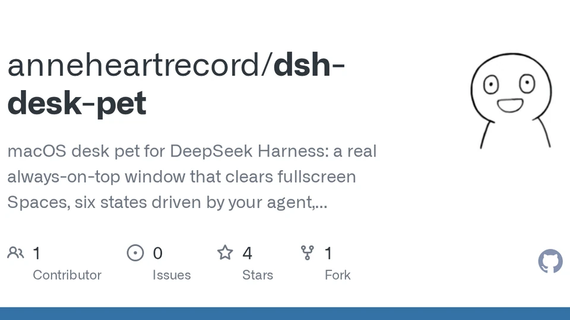
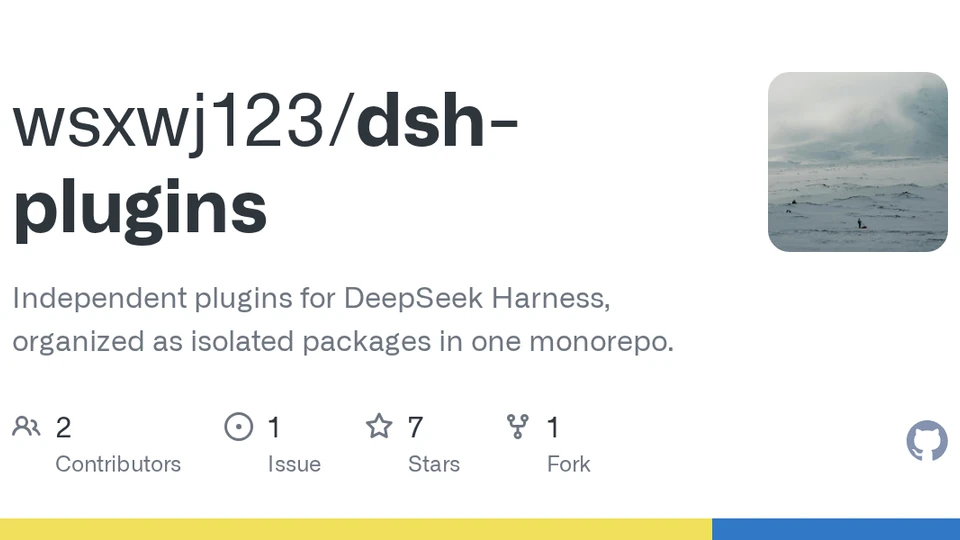

# DSH 主题

[返回 README](README.md) · [English](THEMES.en.md)

共收录 134 个主题。此页面由 `entries/` 自动生成。

| 名称 | 预览 | 上游 |
| --- | --- | --- |
| [dsh-neo-skin](https://github.com/0nt-one/dsh-neo-skin) |  | [0nt-one/dsh-neo-skin](https://github.com/0nt-one/dsh-neo-skin) |
| [dsh-arcaea-theme](https://github.com/a1swg1159-pixel/dsh-arcaea-theme) |  | [a1swg1159-pixel/dsh-arcaea-theme](https://github.com/a1swg1159-pixel/dsh-arcaea-theme) |
| [dsh-pixel-skin](https://github.com/ADAning/dsh-pixel-skin) |  | [ADAning/dsh-pixel-skin](https://github.com/ADAning/dsh-pixel-skin) |
| [dsh-cyberpunk-theme](https://github.com/ai7603/dsh-cyberpunk-theme) |  | [ai7603/dsh-cyberpunk-theme](https://github.com/ai7603/dsh-cyberpunk-theme) |
| [dsh-cyber-particle](https://github.com/AKS1st/dsh-cyber-particle) |  | [AKS1st/dsh-cyber-particle](https://github.com/AKS1st/dsh-cyber-particle) |
| [ikun-theme-skin](https://github.com/AKS1st/ikun-theme-skin) |  | [AKS1st/ikun-theme-skin](https://github.com/AKS1st/ikun-theme-skin) |
| [dsh-gif-background](https://github.com/alcohol-101/dsh-gif-background) |  | [alcohol-101/dsh-gif-background](https://github.com/alcohol-101/dsh-gif-background) |
| [dsh-plugin-gouden-leeuw-theme](https://github.com/Andy294753951/dsh-plugin-gouden-leeuw-theme) |  | [Andy294753951/dsh-plugin-gouden-leeuw-theme](https://github.com/Andy294753951/dsh-plugin-gouden-leeuw-theme) |
| [dsh-eye-care](https://github.com/Anionex/dsh-eye-care) |  | [Anionex/dsh-eye-care](https://github.com/Anionex/dsh-eye-care) |
| [dsh-desk-pet](https://github.com/anneheartrecord/dsh-desk-pet) |  | [anneheartrecord/dsh-desk-pet](https://github.com/anneheartrecord/dsh-desk-pet) |
| [dsh-theme-plugin](https://github.com/BeiZi6/dsh-theme-plugin) |  | [BeiZi6/dsh-theme-plugin](https://github.com/BeiZi6/dsh-theme-plugin) |
| [deepseek-harness-angelina-themes](https://github.com/bilbillm/deepseek-harness-angelina-themes) |  | [bilbillm/deepseek-harness-angelina-themes](https://github.com/bilbillm/deepseek-harness-angelina-themes) |
| [dsh-plugin-image-wallpaper](https://github.com/CaoNing3212/dsh-plugin-image-wallpaper) |  | [CaoNing3212/dsh-plugin-image-wallpaper](https://github.com/CaoNing3212/dsh-plugin-image-wallpaper) |
| [dsh-client-ui-skins](https://github.com/caoyiwei850/dsh-client-ui-skins) |  | [caoyiwei850/dsh-client-ui-skins](https://github.com/caoyiwei850/dsh-client-ui-skins) |
| [dsh-image-theme](https://github.com/Carpon39038/dsh-image-theme) |  | [Carpon39038/dsh-image-theme](https://github.com/Carpon39038/dsh-image-theme) |
| [wishadel-theme](https://github.com/cdxDNRF/wishadel-theme) |  | [cdxDNRF/wishadel-theme](https://github.com/cdxDNRF/wishadel-theme) |
| [dsh-claude-theme](https://github.com/chajiuqqq/dsh-claude-theme) |  | [chajiuqqq/dsh-claude-theme](https://github.com/chajiuqqq/dsh-claude-theme) |
| [dsh-fgo-chaldea](https://github.com/CharlesAQ/dsh-fgo-chaldea) |  | [CharlesAQ/dsh-fgo-chaldea](https://github.com/CharlesAQ/dsh-fgo-chaldea) |
| [dsh-wallpaper](https://github.com/chinaRXQ/dsh-wallpaper) |  | [chinaRXQ/dsh-wallpaper](https://github.com/chinaRXQ/dsh-wallpaper) |
| [shuimo-skin](https://github.com/cnskycn/shuimo-skin) |  | [cnskycn/shuimo-skin](https://github.com/cnskycn/shuimo-skin) |
| [Open Sea 海洋皮肤](https://github.com/d-dev0101/open-sea-skin) |  | [d-dev0101/open-sea-skin](https://github.com/d-dev0101/open-sea-skin) |
| [dsh-theme-center](https://github.com/dac114514/dsh-theme-center) |  | [dac114514/dsh-theme-center](https://github.com/dac114514/dsh-theme-center) |
| [dskin](https://github.com/dancingmemory/dskin) |  | [dancingmemory/dskin](https://github.com/dancingmemory/dskin) |
| [dsh-skin-kamisato](https://github.com/Danieltoraji/dsh-skin-kamisato) |  | [Danieltoraji/dsh-skin-kamisato](https://github.com/Danieltoraji/dsh-skin-kamisato) |
| [dsh-client-ui-m3-theme](https://github.com/DarkskyX15/dsh-client-ui-m3-theme) |  | [DarkskyX15/dsh-client-ui-m3-theme](https://github.com/DarkskyX15/dsh-client-ui-m3-theme) |
| [dsh-naiwa-theme](https://github.com/DevourerM/dsh-naiwa-theme) |  | [DevourerM/dsh-naiwa-theme](https://github.com/DevourerM/dsh-naiwa-theme) |
| [dsh-theme-cyberpunk](https://github.com/dlpufan/dsh-theme-cyberpunk) |  | [dlpufan/dsh-theme-cyberpunk](https://github.com/dlpufan/dsh-theme-cyberpunk) |
| [pramanix-eyjafjalla](https://github.com/DocJlm/dsh-arknights) |  | [DocJlm/dsh-arknights](https://github.com/DocJlm/dsh-arknights) |
| [dsh-theme-neko](https://github.com/drfccv/dsh-theme-neko) |  | [drfccv/dsh-theme-neko](https://github.com/drfccv/dsh-theme-neko) |
| [dsh-thought-buddy](https://github.com/dsh-plugins/dsh-thought-buddy) |  | [dsh-plugins/dsh-thought-buddy](https://github.com/dsh-plugins/dsh-thought-buddy) |
| [dafy-whale-theme](https://github.com/DViridescent/dafy-whale-theme) |  | [DViridescent/dafy-whale-theme](https://github.com/DViridescent/dafy-whale-theme) |
| [dsh-outdoor-theme](https://github.com/Estellalee/dsh-outdoor-theme) |  | [Estellalee/dsh-outdoor-theme](https://github.com/Estellalee/dsh-outdoor-theme) |
| [达妮娅 · 虚无之泡](https://github.com/Ewnscat-ya/dsh-client-ui-skin-denia) |  | [Ewnscat-ya/dsh-client-ui-skin-denia](https://github.com/Ewnscat-ya/dsh-client-ui-skin-denia) |
| [dsh-whale-bg](https://github.com/gooosie/dsh-whale-bg) |  | [gooosie/dsh-whale-bg](https://github.com/gooosie/dsh-whale-bg) |
| [dsh-stylevault](https://github.com/GptsApp/dsh-stylevault) |  | [GptsApp/dsh-stylevault](https://github.com/GptsApp/dsh-stylevault) |
| [dsh-aemeath](https://github.com/hachimi-ai/dsh-aemeath) |  | [hachimi-ai/dsh-aemeath](https://github.com/hachimi-ai/dsh-aemeath) |
| [dsh-extensions-wallpaperskin](https://github.com/haibala-aii/dsh-extensions-wallpaperskin) |  | [haibala-aii/dsh-extensions-wallpaperskin](https://github.com/haibala-aii/dsh-extensions-wallpaperskin) |
| [dsh-task-console](https://github.com/He2way/dsh-task-console) |  | [He2way/dsh-task-console](https://github.com/He2way/dsh-task-console) |
| [dsh-krill-theme](https://github.com/i1j/dsh-krill-theme) |  | [i1j/dsh-krill-theme](https://github.com/i1j/dsh-krill-theme) |
| [dsh-theme-kit](https://github.com/ink5897/dsh-theme-kit) |  | [ink5897/dsh-theme-kit](https://github.com/ink5897/dsh-theme-kit) |
| [dsh-anthropic-fonts](https://github.com/Isilsolme/dsh-anthropic-fonts) |  | [Isilsolme/dsh-anthropic-fonts](https://github.com/Isilsolme/dsh-anthropic-fonts) |
| [dsh-image-skin](https://github.com/Jack-sun-learner/dsh-image-skin) |  | [Jack-sun-learner/dsh-image-skin](https://github.com/Jack-sun-learner/dsh-image-skin) |
| [dsh-fate-twin-contract](https://github.com/Jayliu2025-vip/dsh-fate-twin-contract) |  | [Jayliu2025-vip/dsh-fate-twin-contract](https://github.com/Jayliu2025-vip/dsh-fate-twin-contract) |
| [dsh-theme-huluwa](https://github.com/Jayliu2025-vip/dsh-theme-huluwa) |  | [Jayliu2025-vip/dsh-theme-huluwa](https://github.com/Jayliu2025-vip/dsh-theme-huluwa) |
| [dsh-wallpaper-rotator-enhanced](https://github.com/Jieice/dsh-wallpaper-rotator-enhanced) |  | [Jieice/dsh-wallpaper-rotator-enhanced](https://github.com/Jieice/dsh-wallpaper-rotator-enhanced) |
| [滑动变祖](https://github.com/kingOfSoySauce/dsh-liang-skin) |  | [kingOfSoySauce/dsh-liang-skin](https://github.com/kingOfSoySauce/dsh-liang-skin) |
| [dsh-skin](https://github.com/KinGao294/dsh-skin) |  | [KinGao294/dsh-skin](https://github.com/KinGao294/dsh-skin) |
| [dsh-theme-switch](https://github.com/kinmat-A/dsh-theme-switch) |  | [kinmat-A/dsh-theme-switch](https://github.com/kinmat-A/dsh-theme-switch) |
| [dhs-theme-plugin](https://github.com/kongxiangyiren/dhs-theme-plugin) |  | [kongxiangyiren/dhs-theme-plugin](https://github.com/kongxiangyiren/dhs-theme-plugin) |
| [DeepSeek-Harness-yizi-themes](https://github.com/laoduu/DeepSeek-Harness-yizi-themes) |  | [laoduu/DeepSeek-Harness-yizi-themes](https://github.com/laoduu/DeepSeek-Harness-yizi-themes) |
| [dsh-qq2006](https://github.com/LaplaceYoung/dsh-qq2006) |  | [LaplaceYoung/dsh-qq2006](https://github.com/LaplaceYoung/dsh-qq2006) |
| [dsh-skin-claude-code](https://github.com/le-soleil-se-couche/dsh-skin-claude-code) |  | [le-soleil-se-couche/dsh-skin-claude-code](https://github.com/le-soleil-se-couche/dsh-skin-claude-code) |
| [dsh-qq2007-skin](https://github.com/LeemanCheung/dsh-qq2007-skin) |  | [LeemanCheung/dsh-qq2007-skin](https://github.com/LeemanCheung/dsh-qq2007-skin) |
| [dsh-whale-companion](https://github.com/LeemanCheung/dsh-whale-companion) |  | [LeemanCheung/dsh-whale-companion](https://github.com/LeemanCheung/dsh-whale-companion) |
| [dsh-815-skin](https://github.com/lengduan/dsh-815-skin) |  | [lengduan/dsh-815-skin](https://github.com/lengduan/dsh-815-skin) |
| [dsh-neu-theme](https://github.com/Lhy723/dsh-neu-theme) |  | [Lhy723/dsh-neu-theme](https://github.com/Lhy723/dsh-neu-theme) |
| [dsh-wechat-skin](https://github.com/licheng-ma/dsh-wechat-skin) |  | [licheng-ma/dsh-wechat-skin](https://github.com/licheng-ma/dsh-wechat-skin) |
| [liuli-theme](https://github.com/LilycleHeart/liuli-theme) |  | [LilycleHeart/liuli-theme](https://github.com/LilycleHeart/liuli-theme) |
| [dsh-billing-glass](https://github.com/linkingoscar/dsh-billing-glass) |  | [linkingoscar/dsh-billing-glass](https://github.com/linkingoscar/dsh-billing-glass) |
| [dsh-skin-study](https://github.com/linzhuoliSOC/dsh-skin-study) |  | [linzhuoliSOC/dsh-skin-study](https://github.com/linzhuoliSOC/dsh-skin-study) |
| [dsh-theme-ti](https://github.com/longyu065/dsh-theme-ti) |  | [longyu065/dsh-theme-ti](https://github.com/longyu065/dsh-theme-ti) |
| [dsh-ui-preset-enhance](https://github.com/lssyd20070106/dsh-ui-preset-enhance) |  | [lssyd20070106/dsh-ui-preset-enhance](https://github.com/lssyd20070106/dsh-ui-preset-enhance) |
| [dsh-background](https://github.com/luoyu-xingu/dsh-background) |  | [luoyu-xingu/dsh-background](https://github.com/luoyu-xingu/dsh-background) |
| [dsh-dracula](https://github.com/lzylyd/dsh-dracula) |  | [lzylyd/dsh-dracula](https://github.com/lzylyd/dsh-dracula) |
| [dsh-webUI-Glass-Theme](https://github.com/makuralymi/dsh-webUI-Glass-Theme) |  | [makuralymi/dsh-webUI-Glass-Theme](https://github.com/makuralymi/dsh-webUI-Glass-Theme) |
| [dsh-themes](https://github.com/MangMax/dsh-themes) |  | [MangMax/dsh-themes](https://github.com/MangMax/dsh-themes) |
| [dsh-theme-taffy](https://github.com/Misaki14987/dsh-theme-taffy) |  | [Misaki14987/dsh-theme-taffy](https://github.com/Misaki14987/dsh-theme-taffy) |
| [dsh-nene-theme](https://github.com/mizuhara37/dsh-nene-theme) |  | [mizuhara37/dsh-nene-theme](https://github.com/mizuhara37/dsh-nene-theme) |
| [dsh-blue-archive-shiroko](https://github.com/mldhao/dsh-blue-archive-shiroko) |  | [mldhao/dsh-blue-archive-shiroko](https://github.com/mldhao/dsh-blue-archive-shiroko) |
| [chiral-pulse](https://github.com/MoonShadow1976/chiral-pulse) |  | [MoonShadow1976/chiral-pulse](https://github.com/MoonShadow1976/chiral-pulse) |
| [dsh-pnc-theme](https://github.com/Morinissleeping/dsh-pnc-theme) |  | [Morinissleeping/dsh-pnc-theme](https://github.com/Morinissleeping/dsh-pnc-theme) |
| [dsh-material-you](https://github.com/mtaech/dsh-material-you) |  | [mtaech/dsh-material-you](https://github.com/mtaech/dsh-material-you) |
| [dsh-theme-rheostat](https://github.com/nineandnine-9/dsh-theme-rheostat) |  | [nineandnine-9/dsh-theme-rheostat](https://github.com/nineandnine-9/dsh-theme-rheostat) |
| [dsh-skin-glass](https://github.com/noexcs/dsh-skin-glass) |  | [noexcs/dsh-skin-glass](https://github.com/noexcs/dsh-skin-glass) |
| [dsh-catppuccin](https://github.com/NoNameLeGo/dsh-catppuccin) |  | [NoNameLeGo/dsh-catppuccin](https://github.com/NoNameLeGo/dsh-catppuccin) |
| [dsh-eva-theme-plugin](https://github.com/oceanxuikun/dsh-eva-theme-plugin) |  | [oceanxuikun/dsh-eva-theme-plugin](https://github.com/oceanxuikun/dsh-eva-theme-plugin) |
| [dsh-fun-weather](https://github.com/omdsh-dev/dsh-fun-weather) |  | [omdsh-dev/dsh-fun-weather](https://github.com/omdsh-dev/dsh-fun-weather) |
| [dsh-client-ui-skin-claude](https://github.com/PAKIKNOWLEDGE/dsh-client-ui-skin-claude) |  | [PAKIKNOWLEDGE/dsh-client-ui-skin-claude](https://github.com/PAKIKNOWLEDGE/dsh-client-ui-skin-claude) |
| [dsh-theme-palettes](https://github.com/RainbowDashy/dsh-theme-palettes) |  | [RainbowDashy/dsh-theme-palettes](https://github.com/RainbowDashy/dsh-theme-palettes) |
| [claude-parchment-theme](https://github.com/RayYeung1989/claude-parchment-theme) |  | [RayYeung1989/claude-parchment-theme](https://github.com/RayYeung1989/claude-parchment-theme) |
| [dsh-theme-colorizer](https://github.com/RealHacker/dsh-theme-colorizer) |  | [RealHacker/dsh-theme-colorizer](https://github.com/RealHacker/dsh-theme-colorizer) |
| [dsh_Rhine_Lab_themo](https://github.com/ReLuckyLucy/dsh_Rhine_Lab_themo) |  | [ReLuckyLucy/dsh_Rhine_Lab_themo](https://github.com/ReLuckyLucy/dsh_Rhine_Lab_themo) |
| [dsh-dream-skin](https://github.com/RevolutionLA/dsh-dream-skin) |  | [RevolutionLA/dsh-dream-skin](https://github.com/RevolutionLA/dsh-dream-skin) |
| [dsh-skin](https://github.com/sakka6868/dsh-skin) |  | [sakka6868/dsh-skin](https://github.com/sakka6868/dsh-skin) |
| [dsh-client-ui-theme-xp](https://github.com/SamizuHM/dsh-client-ui-theme-xp) |  | [SamizuHM/dsh-client-ui-theme-xp](https://github.com/SamizuHM/dsh-client-ui-theme-xp) |
| [dsh-aurora-theme](https://github.com/seekerwxy/dsh-aurora-theme) |  | [seekerwxy/dsh-aurora-theme](https://github.com/seekerwxy/dsh-aurora-theme) |
| [dsh-frosted-window](https://github.com/SenryLee/dsh-frosted-window) |  | [SenryLee/dsh-frosted-window](https://github.com/SenryLee/dsh-frosted-window) |
| [dsh-weather-plugin](https://github.com/shenmy-git/dsh-weather-plugin) |  | [shenmy-git/dsh-weather-plugin](https://github.com/shenmy-git/dsh-weather-plugin) |
| [dsh-vscode-theme](https://github.com/Sim-xia/dsh-vscode-theme) |  | [Sim-xia/dsh-vscode-theme](https://github.com/Sim-xia/dsh-vscode-theme) |
| [深海女仆工坊](https://github.com/Small-tailqwq/dsh-deep-whale) |  | [Small-tailqwq/dsh-deep-whale](https://github.com/Small-tailqwq/dsh-deep-whale) |
| [dsh-blue-whale](https://github.com/starslittle/dsh-blue-whale) |  | [starslittle/dsh-blue-whale](https://github.com/starslittle/dsh-blue-whale) |
| [freestyle-dsh-theme](https://github.com/suzike/freestyle-dsh-theme) |  | [suzike/freestyle-dsh-theme](https://github.com/suzike/freestyle-dsh-theme) |
| [dsh-theme-background-center](https://github.com/syOPV/dsh-theme-background-center) |  | [syOPV/dsh-theme-background-center](https://github.com/syOPV/dsh-theme-background-center) |
| [dph-endfield-theme](https://github.com/thjyy/dph-endfield-theme) |  | [thjyy/dph-endfield-theme](https://github.com/thjyy/dph-endfield-theme) |
| [dsh-skin-toggle](https://github.com/tiantyu/dsh-skin-toggle) |  | [tiantyu/dsh-skin-toggle](https://github.com/tiantyu/dsh-skin-toggle) |
| [dsh-wallpaper-engine](https://github.com/TianYa-DAO/dsh-wallpaper-engine) |  | [TianYa-DAO/dsh-wallpaper-engine](https://github.com/TianYa-DAO/dsh-wallpaper-engine) |
| [dsh-font](https://github.com/tianyhjg-lab/dsh-font) |  | [tianyhjg-lab/dsh-font](https://github.com/tianyhjg-lab/dsh-font) |
| [dsh-any-background](https://github.com/Tkingxiao/dsh-any-background) |  | [Tkingxiao/dsh-any-background](https://github.com/Tkingxiao/dsh-any-background) |
| [dsh-theme-cyberpunk2077](https://github.com/Tommy00748/dsh-theme-cyberpunk2077) |  | [Tommy00748/dsh-theme-cyberpunk2077](https://github.com/Tommy00748/dsh-theme-cyberpunk2077) |
| [dsh-joi-channel-theme](https://github.com/tpmoonchefryan/dsh-joi-channel-theme) |  | [tpmoonchefryan/dsh-joi-channel-theme](https://github.com/tpmoonchefryan/dsh-joi-channel-theme) |
| [dsh-ui-appearance](https://github.com/TQSY114514/dsh-ui-appearance) |  | [TQSY114514/dsh-ui-appearance](https://github.com/TQSY114514/dsh-ui-appearance) |
| [dsh-whale-background](https://github.com/tuogusa/dsh-whale-background) |  | [tuogusa/dsh-whale-background](https://github.com/tuogusa/dsh-whale-background) |
| [dsh-web-theme-packs](https://github.com/tzy168/dsh-web-theme-packs) |  | [tzy168/dsh-web-theme-packs](https://github.com/tzy168/dsh-web-theme-packs) |
| [dsh-skin-appearance](https://github.com/Vim0x3c/dsh-skin-appearance) |  | [Vim0x3c/dsh-skin-appearance](https://github.com/Vim0x3c/dsh-skin-appearance) |
| [dsh-glassic-mist-theme](https://github.com/VlanTech/dsh-glassic-mist-theme) |  | [VlanTech/dsh-glassic-mist-theme](https://github.com/VlanTech/dsh-glassic-mist-theme) |
| [deepseek-harness-custom-background](https://github.com/vonPaulison/deepseek-harness-custom-background) |  | [vonPaulison/deepseek-harness-custom-background](https://github.com/vonPaulison/deepseek-harness-custom-background) |
| [dsh-wx-skin](https://github.com/wangxilhy23/dsh-wx-skin) |  | [wangxilhy23/dsh-wx-skin](https://github.com/wangxilhy23/dsh-wx-skin) |
| [dsh-skin-amis](https://github.com/wanzhiwei5/dsh-skin-amis) |  | [wanzhiwei5/dsh-skin-amis](https://github.com/wanzhiwei5/dsh-skin-amis) |
| [dsh-file-explorer-preview-code](https://github.com/wolfsonliu/dsh-file-explorer-preview-code) |  | [wolfsonliu/dsh-file-explorer-preview-code](https://github.com/wolfsonliu/dsh-file-explorer-preview-code) |
| [skin-gallery](https://github.com/wsxwj123/dsh-plugins) |  | [wsxwj123/dsh-plugins](https://github.com/wsxwj123/dsh-plugins) |
| [theme-gallery](https://github.com/wsxwj123/dsh-plugins) |  | [wsxwj123/dsh-plugins](https://github.com/wsxwj123/dsh-plugins) |
| [dsh-theme-paper](https://github.com/WuWL-98/dsh-theme-paper) |  | [WuWL-98/dsh-theme-paper](https://github.com/WuWL-98/dsh-theme-paper) |
| [dsh-matrix-theme](https://github.com/wuzhong962-alt/dsh-matrix-theme) |  | [wuzhong962-alt/dsh-matrix-theme](https://github.com/wuzhong962-alt/dsh-matrix-theme) |
| [DSH-Transparent-UI-Plugin](https://github.com/WYH66666666/DSH-Transparent-UI-Plugin) |  | [WYH66666666/DSH-Transparent-UI-Plugin](https://github.com/WYH66666666/DSH-Transparent-UI-Plugin) |
| [dsh-x9-theme](https://github.com/X9wd09ncc/dsh-x9-theme) |  | [X9wd09ncc/dsh-x9-theme](https://github.com/X9wd09ncc/dsh-x9-theme) |
| [touhou-hakurei](https://github.com/xiake595/touhou-hakurei) |  | [xiake595/touhou-hakurei](https://github.com/xiake595/touhou-hakurei) |
| [dsh-premium-themes](https://github.com/xiaoyanzi191/dsh-premium-themes) |  | [xiaoyanzi191/dsh-premium-themes](https://github.com/xiaoyanzi191/dsh-premium-themes) |
| [dsh-liquid-glass](https://github.com/xingyingyuzhui/dsh-liquid-glass) |  | [xingyingyuzhui/dsh-liquid-glass](https://github.com/xingyingyuzhui/dsh-liquid-glass) |
| [dsh-client-ui-custom](https://github.com/yoli-mi/dsh-client-ui-custom) |  | [yoli-mi/dsh-client-ui-custom](https://github.com/yoli-mi/dsh-client-ui-custom) |
| [dsh-palenight-theme](https://github.com/youyli03/dsh-palenight-theme) |  | [youyli03/dsh-palenight-theme](https://github.com/youyli03/dsh-palenight-theme) |
| [dsh-ui-wallpaper](https://github.com/youzhoujiMrLiu/dsh-ui-wallpaper) |  | [youzhoujiMrLiu/dsh-ui-wallpaper](https://github.com/youzhoujiMrLiu/dsh-ui-wallpaper) |
| [dsh-wallpaper_share](https://github.com/YRN-playmaker/dsh-wallpaper_share) |  | [YRN-playmaker/dsh-wallpaper_share](https://github.com/YRN-playmaker/dsh-wallpaper_share) |
| [maid-whale-webui](https://github.com/yunxiiQwQ/dsh-maid-whale-webUI) |  | [yunxiiQwQ/dsh-maid-whale-webUI](https://github.com/yunxiiQwQ/dsh-maid-whale-webUI) |
| [dsh-theme-machine](https://github.com/yuqisun/dsh-theme-machine) |  | [yuqisun/dsh-theme-machine](https://github.com/yuqisun/dsh-theme-machine) |
| [dsh-homepage-skin](https://github.com/yushi-xxh/dsh-homepage-skin) |  | [yushi-xxh/dsh-homepage-skin](https://github.com/yushi-xxh/dsh-homepage-skin) |
| [silk-background](https://github.com/z21for99/silk-background) |  | [z21for99/silk-background](https://github.com/z21for99/silk-background) |
| [dsh-background-plugin](https://github.com/z827439974/dsh-background-plugin) |  | [z827439974/dsh-background-plugin](https://github.com/z827439974/dsh-background-plugin) |
| [dsh-pet](https://github.com/zealot00/dsh-pet) |  | [zealot00/dsh-pet](https://github.com/zealot00/dsh-pet) |
| [dsh-skin-blue-whale](https://github.com/zenghuizhu69-hub/dsh-skin-blue-whale) |  | [zenghuizhu69-hub/dsh-skin-blue-whale](https://github.com/zenghuizhu69-hub/dsh-skin-blue-whale) |
| [Catppuccin 四味主题](https://github.com/zhijun-dai/Catppuccin-dsh-theme) |  | [zhijun-dai/Catppuccin-dsh-theme](https://github.com/zhijun-dai/Catppuccin-dsh-theme) |
| [dsh-Fonts](https://github.com/zhijun-dai/dsh-Fonts) |  | [zhijun-dai/dsh-Fonts](https://github.com/zhijun-dai/dsh-Fonts) |
| [Solarized-dsh-theme](https://github.com/zhijun-dai/Solarized-dsh-theme) |  | [zhijun-dai/Solarized-dsh-theme](https://github.com/zhijun-dai/Solarized-dsh-theme) |
| [dsh-oh-my-theme](https://github.com/zhxqc/dsh-oh-my-theme) |  | [zhxqc/dsh-oh-my-theme](https://github.com/zhxqc/dsh-oh-my-theme) |
| [dsh-ivory](https://github.com/ZJUZhiyuCai/dsh-ivory) |  | [ZJUZhiyuCai/dsh-ivory](https://github.com/ZJUZhiyuCai/dsh-ivory) |
