# DSH 主题

[返回 README](README.md) · [English](THEMES.en.md)

共收录 132 个主题。按 Stars 从高到低排序，Stars 相同时按名称排序。

<table width="100%">
<thead>
<tr>
<th width="18%" align="center">名称</th>
<th width="52%" align="center">预览</th>
<th width="23%" align="center">上游</th>
<th width="7%" align="center">Stars</th>
</tr>
</thead>
<tbody>
<tr>
<td align="center" valign="middle">深海女仆工坊</td>
<td align="center" valign="middle">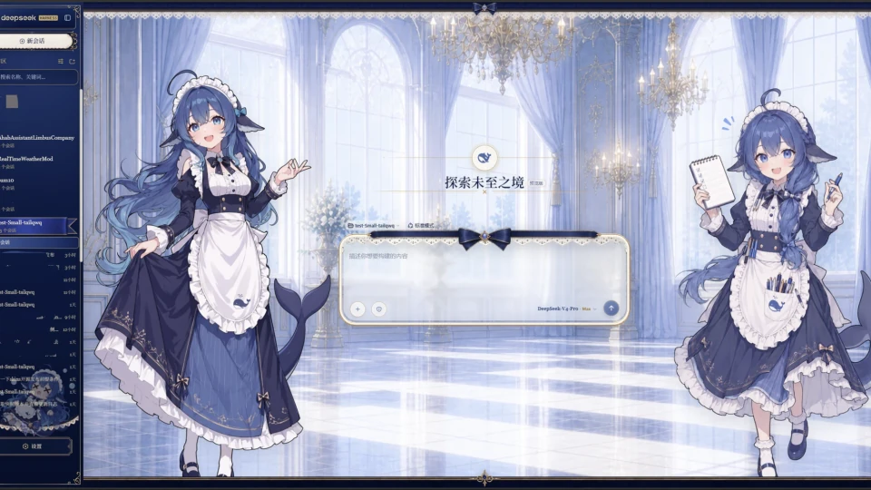</td>
<td align="center" valign="middle"><a href="https://github.com/Small-tailqwq/dsh-deep-whale">Small-tailqwq/dsh-deep-whale</a></td>
<td align="center" valign="middle">1,628</td>
</tr>
<tr>
<td align="center" valign="middle">DSH-Transparent-UI-Plugin</td>
<td align="center" valign="middle">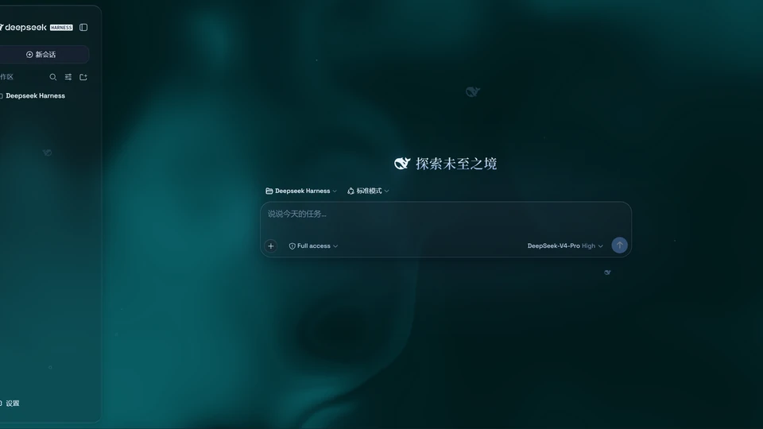</td>
<td align="center" valign="middle"><a href="https://github.com/WYH66666666/DSH-Transparent-UI-Plugin">WYH66666666/DSH-Transparent-UI-Plugin</a></td>
<td align="center" valign="middle">371</td>
</tr>
<tr>
<td align="center" valign="middle">Open Sea 海洋皮肤</td>
<td align="center" valign="middle">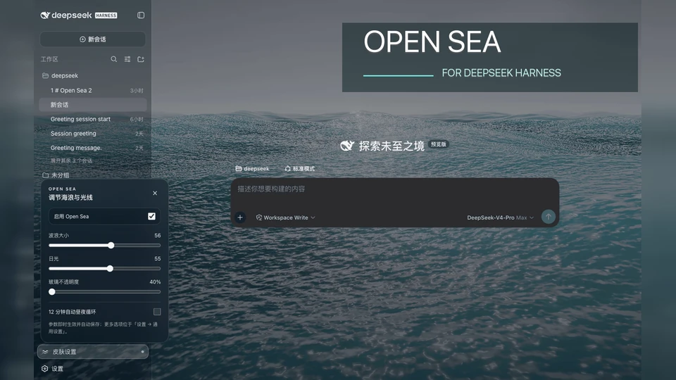</td>
<td align="center" valign="middle"><a href="https://github.com/d-dev0101/open-sea-skin">d-dev0101/open-sea-skin</a></td>
<td align="center" valign="middle">186</td>
</tr>
<tr>
<td align="center" valign="middle">滑动变祖</td>
<td align="center" valign="middle">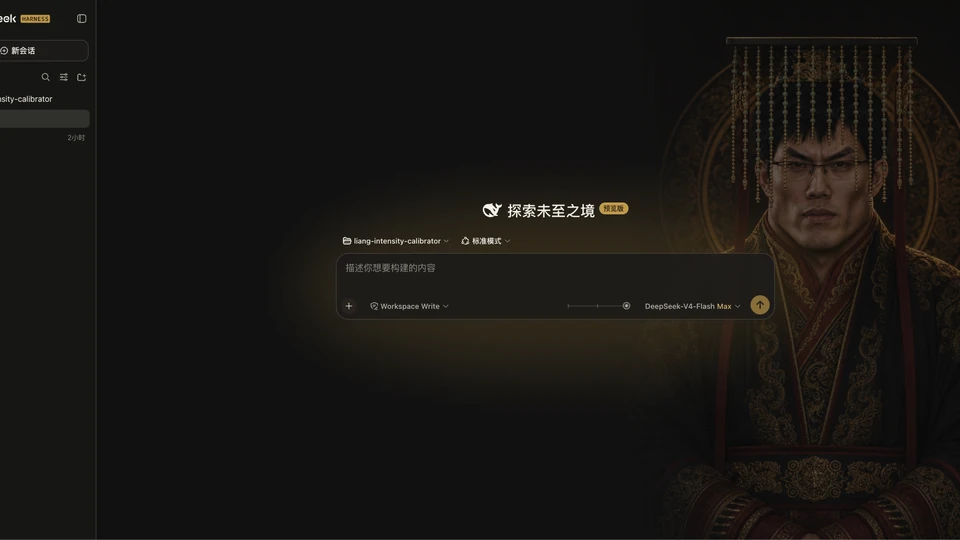</td>
<td align="center" valign="middle"><a href="https://github.com/kingOfSoySauce/dsh-liang-skin">kingOfSoySauce/dsh-liang-skin</a></td>
<td align="center" valign="middle">132</td>
</tr>
<tr>
<td align="center" valign="middle">dsh-dream-skin</td>
<td align="center" valign="middle">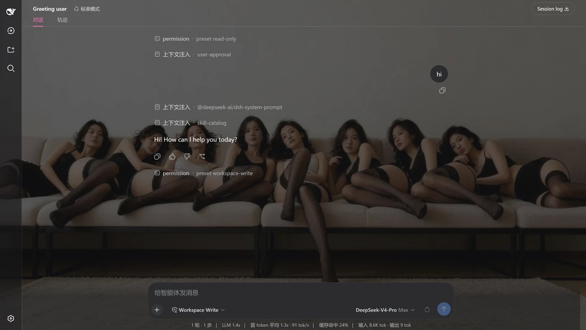</td>
<td align="center" valign="middle"><a href="https://github.com/RevolutionLA/dsh-dream-skin">RevolutionLA/dsh-dream-skin</a></td>
<td align="center" valign="middle">90</td>
</tr>
<tr>
<td align="center" valign="middle">达妮娅 · 虚无之泡</td>
<td align="center" valign="middle">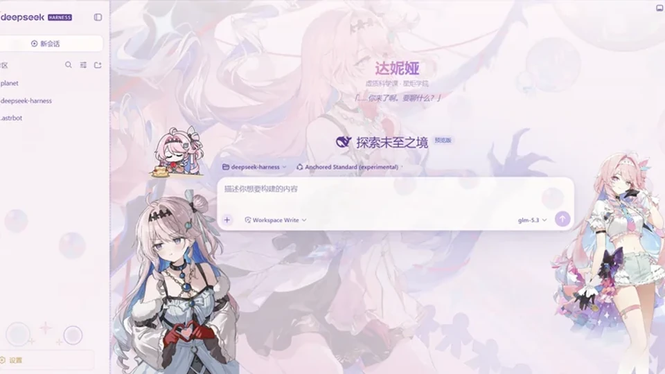</td>
<td align="center" valign="middle"><a href="https://github.com/Ewnscat-ya/dsh-client-ui-skin-denia">Ewnscat-ya/dsh-client-ui-skin-denia</a></td>
<td align="center" valign="middle">28</td>
</tr>
<tr>
<td align="center" valign="middle">dsh-theme-cyberpunk2077</td>
<td align="center" valign="middle">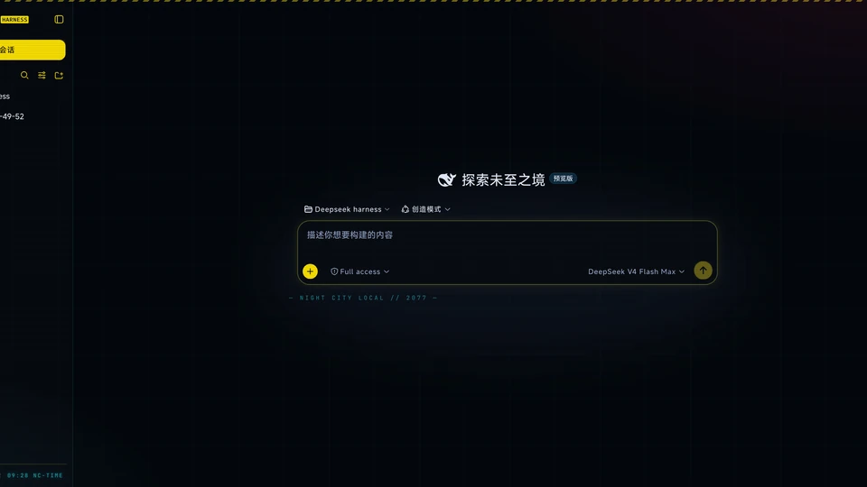</td>
<td align="center" valign="middle"><a href="https://github.com/Tommy00748/dsh-theme-cyberpunk2077">Tommy00748/dsh-theme-cyberpunk2077</a></td>
<td align="center" valign="middle">23</td>
</tr>
<tr>
<td align="center" valign="middle">maid-whale-webui</td>
<td align="center" valign="middle">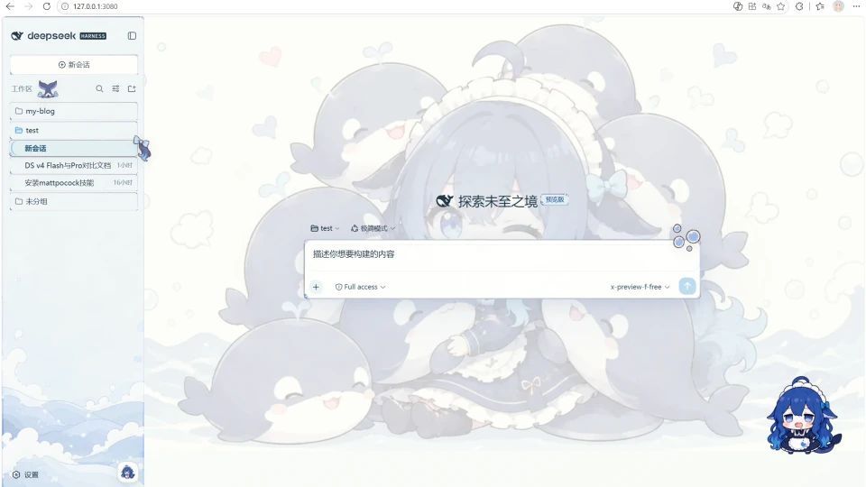</td>
<td align="center" valign="middle"><a href="https://github.com/yunxiiQwQ/dsh-maid-whale-webUI">yunxiiQwQ/dsh-maid-whale-webUI</a></td>
<td align="center" valign="middle">23</td>
</tr>
<tr>
<td align="center" valign="middle">dsh-qq2006</td>
<td align="center" valign="middle">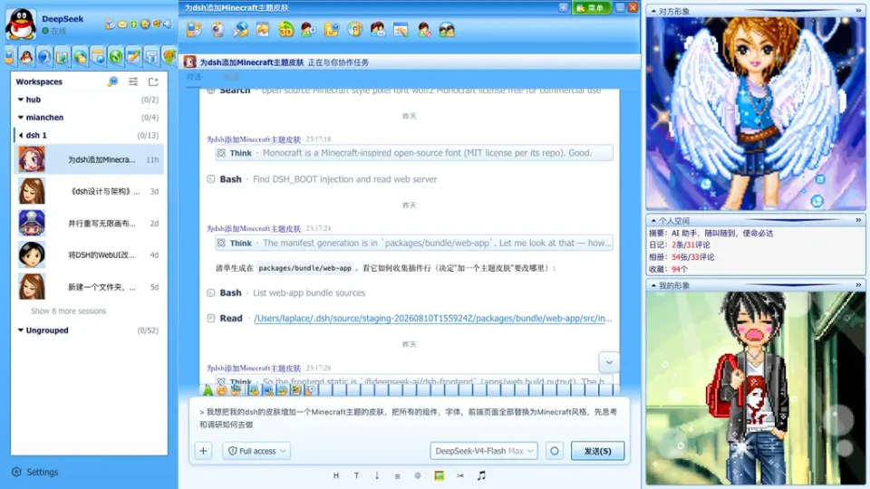</td>
<td align="center" valign="middle"><a href="https://github.com/LaplaceYoung/dsh-qq2006">LaplaceYoung/dsh-qq2006</a></td>
<td align="center" valign="middle">22</td>
</tr>
<tr>
<td align="center" valign="middle">dsh-skin</td>
<td align="center" valign="middle">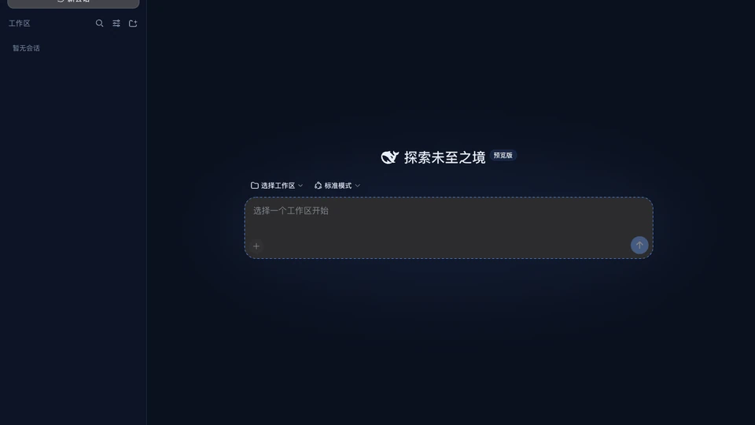</td>
<td align="center" valign="middle"><a href="https://github.com/KinGao294/dsh-skin">KinGao294/dsh-skin</a></td>
<td align="center" valign="middle">19</td>
</tr>
<tr>
<td align="center" valign="middle">dsh-catppuccin</td>
<td align="center" valign="middle">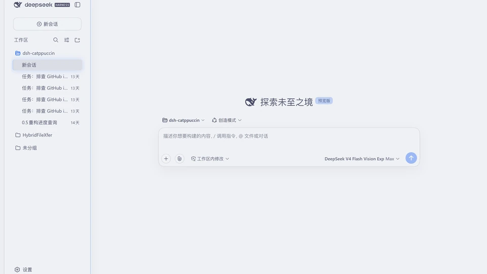</td>
<td align="center" valign="middle"><a href="https://github.com/NoNameLeGo/dsh-catppuccin">NoNameLeGo/dsh-catppuccin</a></td>
<td align="center" valign="middle">18</td>
</tr>
<tr>
<td align="center" valign="middle">touhou-hakurei</td>
<td align="center" valign="middle"></td>
<td align="center" valign="middle"><a href="https://github.com/xiake595/touhou-hakurei">xiake595/touhou-hakurei</a></td>
<td align="center" valign="middle">18</td>
</tr>
<tr>
<td align="center" valign="middle">dsh-any-background</td>
<td align="center" valign="middle">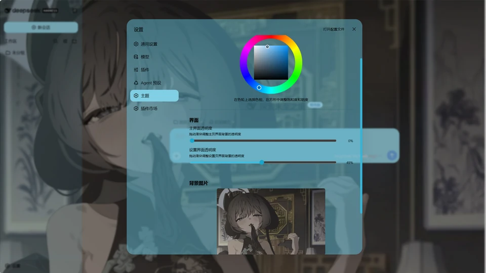</td>
<td align="center" valign="middle"><a href="https://github.com/Tkingxiao/dsh-any-background">Tkingxiao/dsh-any-background</a></td>
<td align="center" valign="middle">16</td>
</tr>
<tr>
<td align="center" valign="middle">freestyle-dsh-theme</td>
<td align="center" valign="middle">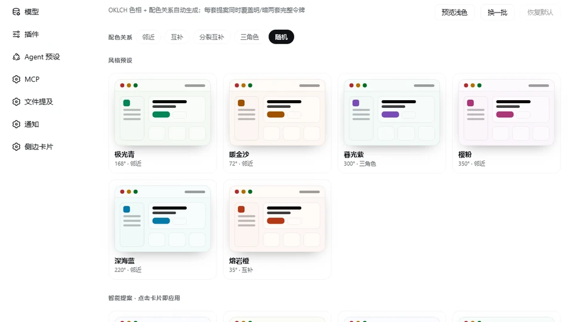</td>
<td align="center" valign="middle"><a href="https://github.com/suzike/freestyle-dsh-theme">suzike/freestyle-dsh-theme</a></td>
<td align="center" valign="middle">12</td>
</tr>
<tr>
<td align="center" valign="middle">dsh-client-ui-custom</td>
<td align="center" valign="middle">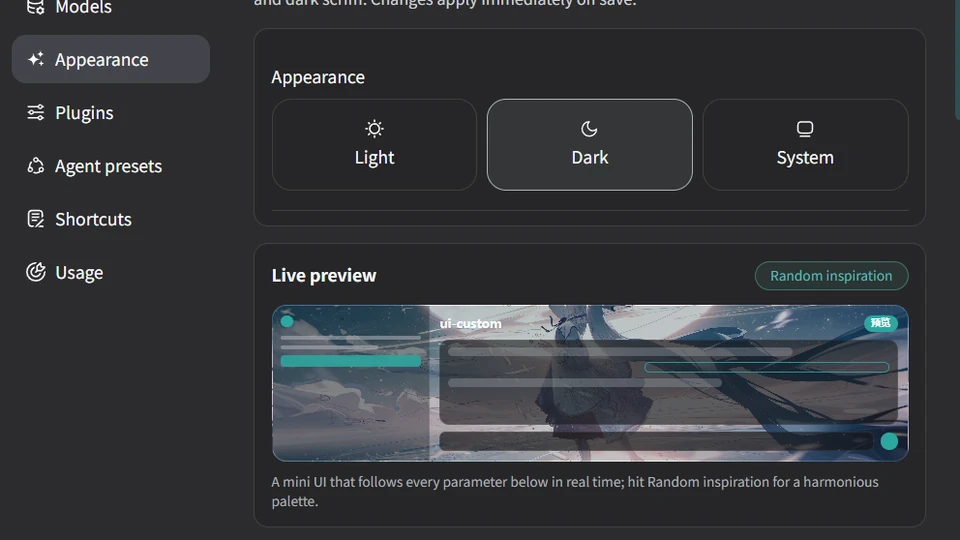</td>
<td align="center" valign="middle"><a href="https://github.com/yoli-mi/dsh-client-ui-custom">yoli-mi/dsh-client-ui-custom</a></td>
<td align="center" valign="middle">11</td>
</tr>
<tr>
<td align="center" valign="middle">dsh-cyber-particle</td>
<td align="center" valign="middle"></td>
<td align="center" valign="middle"><a href="https://github.com/AKS1st/dsh-cyber-particle">AKS1st/dsh-cyber-particle</a></td>
<td align="center" valign="middle">11</td>
</tr>
<tr>
<td align="center" valign="middle">dsh-joi-channel-theme</td>
<td align="center" valign="middle">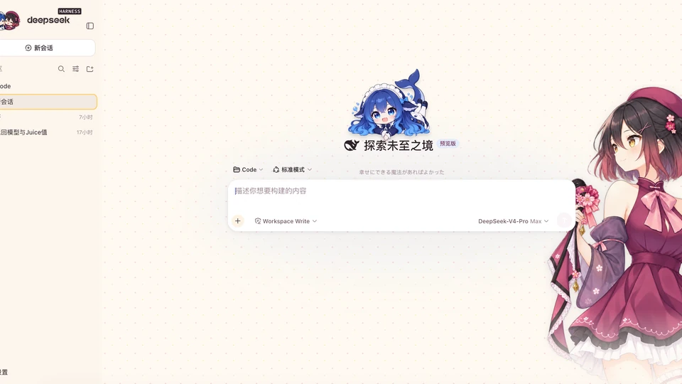</td>
<td align="center" valign="middle"><a href="https://github.com/tpmoonchefryan/dsh-joi-channel-theme">tpmoonchefryan/dsh-joi-channel-theme</a></td>
<td align="center" valign="middle">11</td>
</tr>
<tr>
<td align="center" valign="middle">dsh-liquid-glass</td>
<td align="center" valign="middle">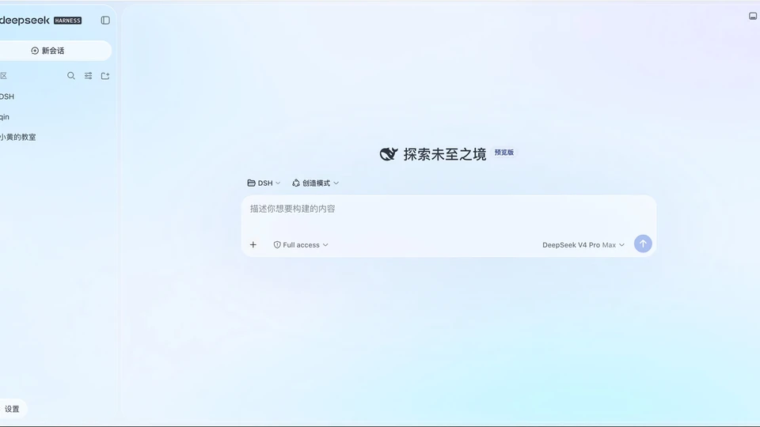</td>
<td align="center" valign="middle"><a href="https://github.com/xingyingyuzhui/dsh-liquid-glass">xingyingyuzhui/dsh-liquid-glass</a></td>
<td align="center" valign="middle">11</td>
</tr>
<tr>
<td align="center" valign="middle">Catppuccin 四味主题</td>
<td align="center" valign="middle">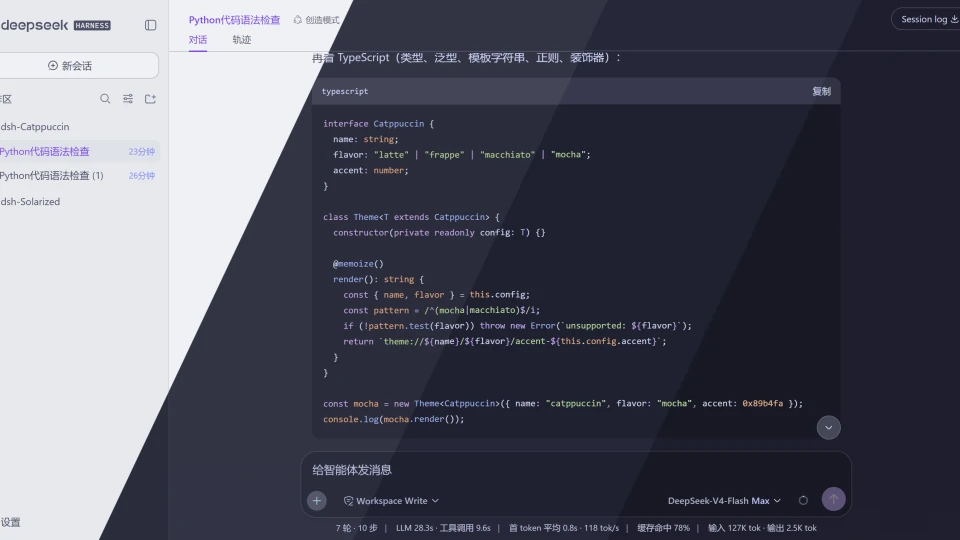</td>
<td align="center" valign="middle"><a href="https://github.com/zhijun-dai/Catppuccin-dsh-theme">zhijun-dai/Catppuccin-dsh-theme</a></td>
<td align="center" valign="middle">10</td>
</tr>
<tr>
<td align="center" valign="middle">dsh-font</td>
<td align="center" valign="middle">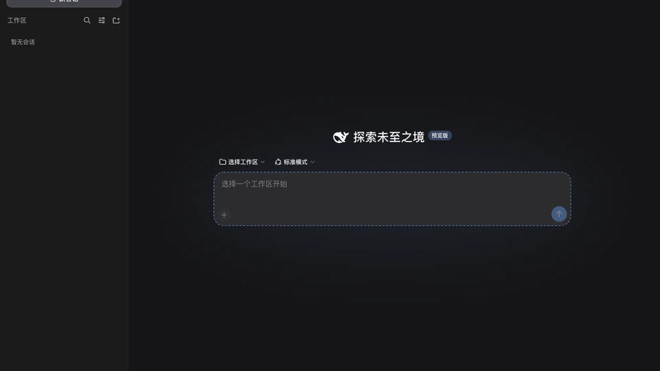</td>
<td align="center" valign="middle"><a href="https://github.com/tianyhjg-lab/dsh-font">tianyhjg-lab/dsh-font</a></td>
<td align="center" valign="middle">10</td>
</tr>
<tr>
<td align="center" valign="middle">dsh-ui-appearance</td>
<td align="center" valign="middle">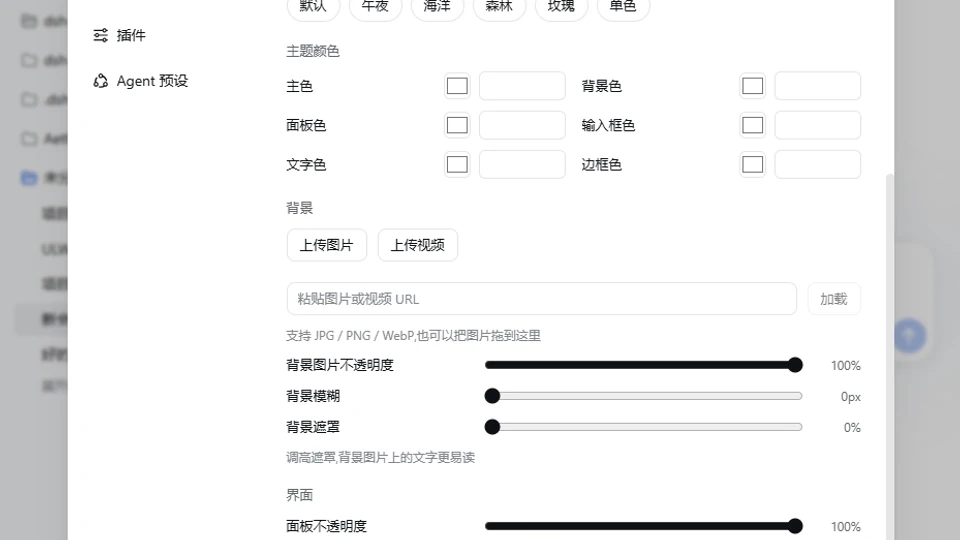</td>
<td align="center" valign="middle"><a href="https://github.com/TQSY114514/dsh-ui-appearance">TQSY114514/dsh-ui-appearance</a></td>
<td align="center" valign="middle">10</td>
</tr>
<tr>
<td align="center" valign="middle">dsh-client-ui-skin-claude</td>
<td align="center" valign="middle">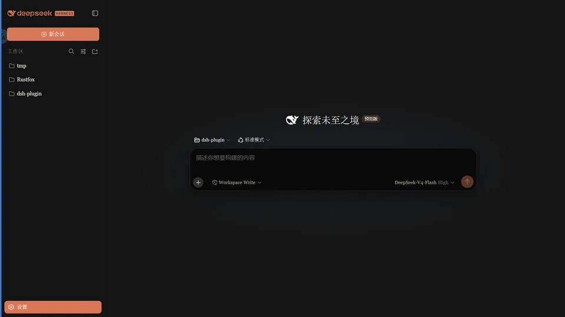</td>
<td align="center" valign="middle"><a href="https://github.com/PAKIKNOWLEDGE/dsh-client-ui-skin-claude">PAKIKNOWLEDGE/dsh-client-ui-skin-claude</a></td>
<td align="center" valign="middle">9</td>
</tr>
<tr>
<td align="center" valign="middle">dsh-wallpaper_share</td>
<td align="center" valign="middle">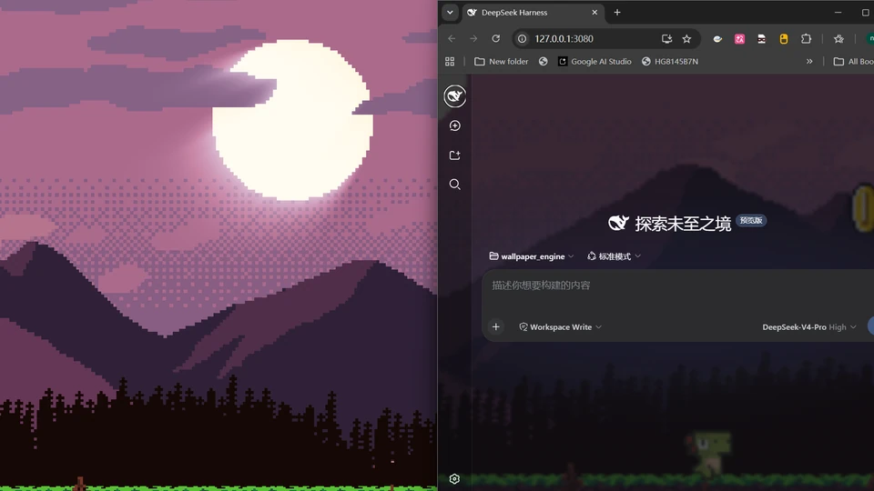</td>
<td align="center" valign="middle"><a href="https://github.com/YRN-playmaker/dsh-wallpaper_share">YRN-playmaker/dsh-wallpaper_share</a></td>
<td align="center" valign="middle">9</td>
</tr>
<tr>
<td align="center" valign="middle">DSH 外观画廊</td>
<td align="center" valign="middle">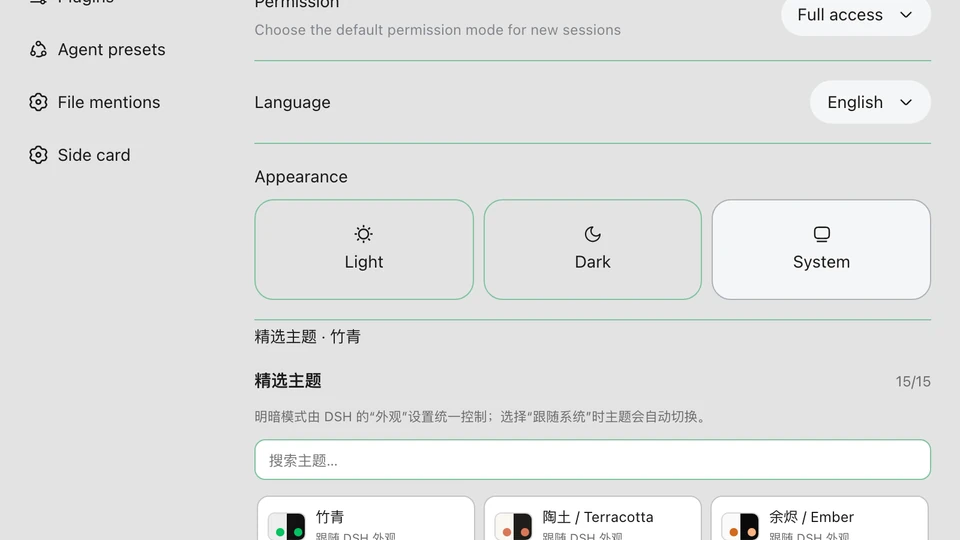</td>
<td align="center" valign="middle"><a href="https://github.com/wsxwj123/dsh-plugins">wsxwj123/dsh-plugins</a></td>
<td align="center" valign="middle">8</td>
</tr>
<tr>
<td align="center" valign="middle">dafy-whale-theme</td>
<td align="center" valign="middle">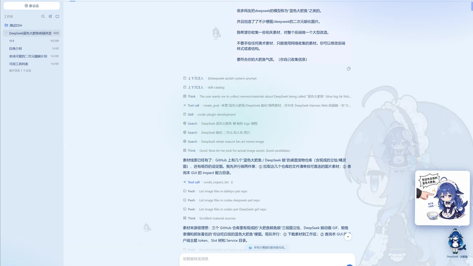</td>
<td align="center" valign="middle"><a href="https://github.com/DViridescent/dafy-whale-theme">DViridescent/dafy-whale-theme</a></td>
<td align="center" valign="middle">7</td>
</tr>
<tr>
<td align="center" valign="middle">dsh-blue-whale</td>
<td align="center" valign="middle">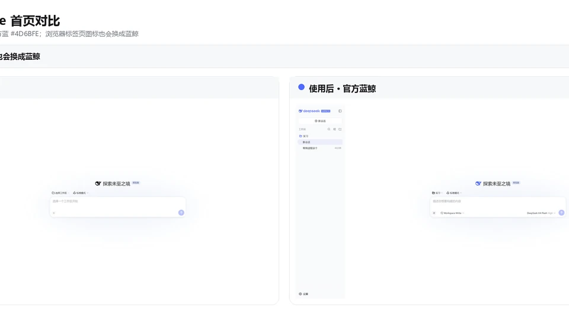</td>
<td align="center" valign="middle"><a href="https://github.com/starslittle/dsh-blue-whale">starslittle/dsh-blue-whale</a></td>
<td align="center" valign="middle">7</td>
</tr>
<tr>
<td align="center" valign="middle">dsh-client-ui-skins</td>
<td align="center" valign="middle">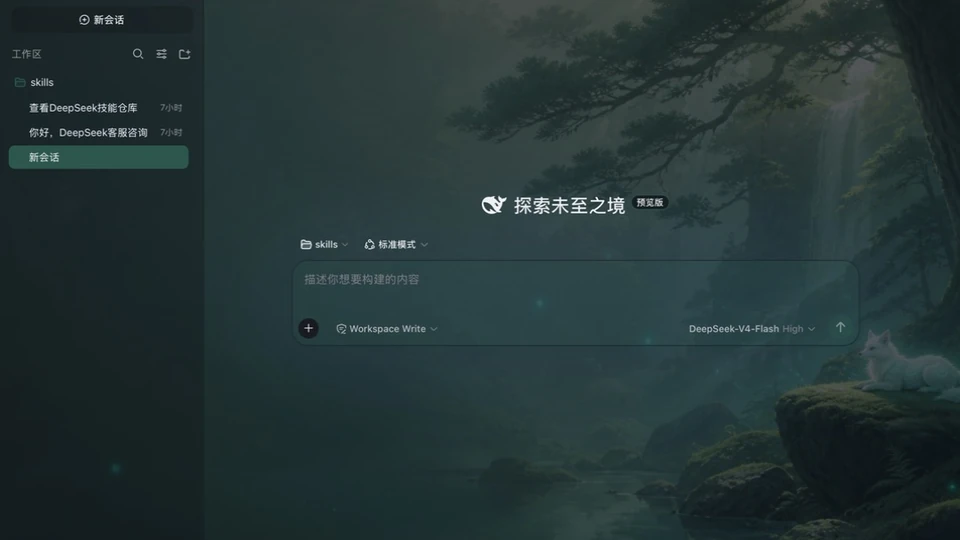</td>
<td align="center" valign="middle"><a href="https://github.com/caoyiwei850/dsh-client-ui-skins">caoyiwei850/dsh-client-ui-skins</a></td>
<td align="center" valign="middle">7</td>
</tr>
<tr>
<td align="center" valign="middle">dsh-client-ui-theme-xp</td>
<td align="center" valign="middle">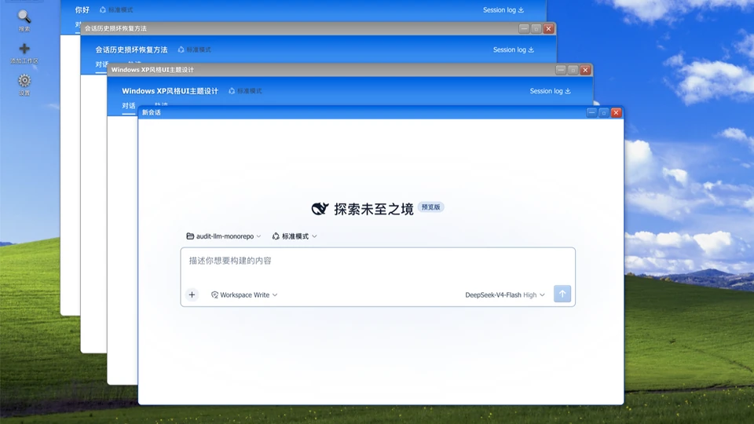</td>
<td align="center" valign="middle"><a href="https://github.com/SamizuHM/dsh-client-ui-theme-xp">SamizuHM/dsh-client-ui-theme-xp</a></td>
<td align="center" valign="middle">7</td>
</tr>
<tr>
<td align="center" valign="middle">dsh-ui-preset-enhance</td>
<td align="center" valign="middle">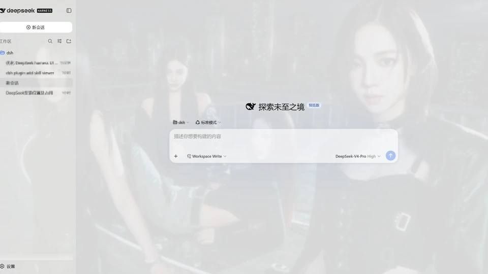</td>
<td align="center" valign="middle"><a href="https://github.com/lssyd20070106/dsh-ui-preset-enhance">lssyd20070106/dsh-ui-preset-enhance</a></td>
<td align="center" valign="middle">7</td>
</tr>
<tr>
<td align="center" valign="middle">dskin</td>
<td align="center" valign="middle">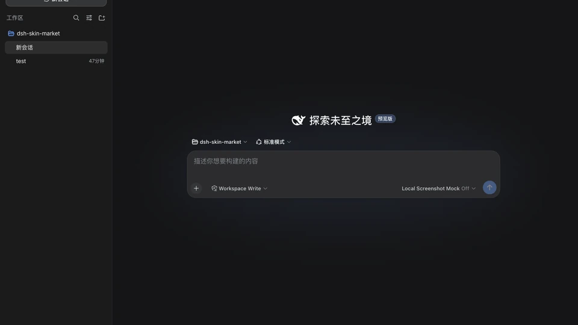</td>
<td align="center" valign="middle"><a href="https://github.com/dancingmemory/dskin">dancingmemory/dskin</a></td>
<td align="center" valign="middle">7</td>
</tr>
<tr>
<td align="center" valign="middle">dsh-oh-my-theme</td>
<td align="center" valign="middle">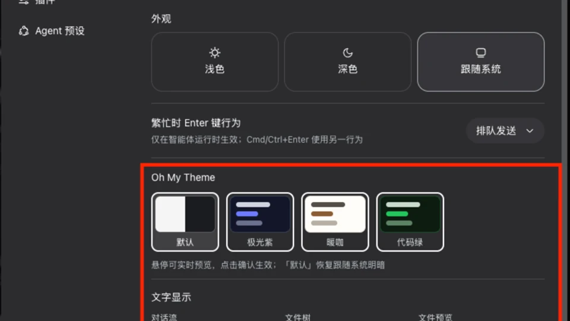</td>
<td align="center" valign="middle"><a href="https://github.com/zhxqc/dsh-oh-my-theme">zhxqc/dsh-oh-my-theme</a></td>
<td align="center" valign="middle">6</td>
</tr>
<tr>
<td align="center" valign="middle">dsh-theme-taffy</td>
<td align="center" valign="middle">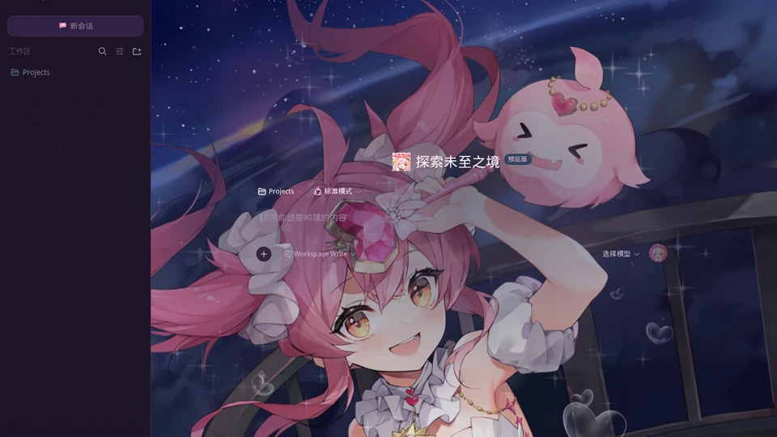</td>
<td align="center" valign="middle"><a href="https://github.com/Misaki14987/dsh-theme-taffy">Misaki14987/dsh-theme-taffy</a></td>
<td align="center" valign="middle">6</td>
</tr>
<tr>
<td align="center" valign="middle">ikun-theme-skin</td>
<td align="center" valign="middle">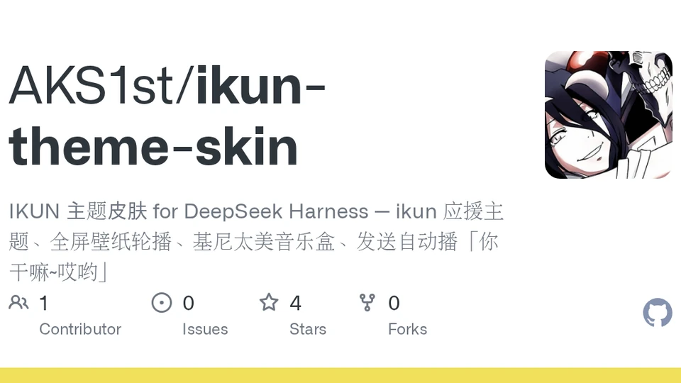</td>
<td align="center" valign="middle"><a href="https://github.com/AKS1st/ikun-theme-skin">AKS1st/ikun-theme-skin</a></td>
<td align="center" valign="middle">6</td>
</tr>
<tr>
<td align="center" valign="middle">deepseek-harness-angelina-themes</td>
<td align="center" valign="middle">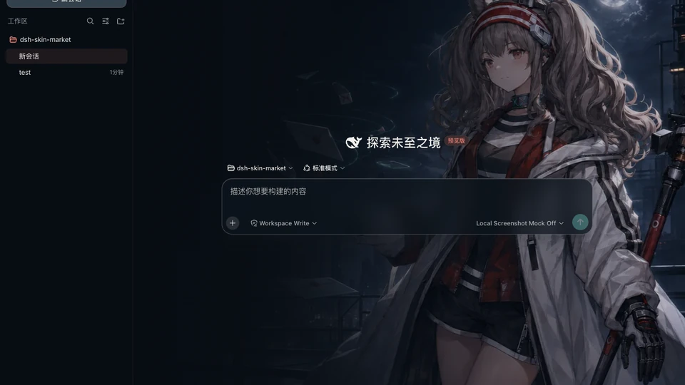</td>
<td align="center" valign="middle"><a href="https://github.com/bilbillm/deepseek-harness-angelina-themes">bilbillm/deepseek-harness-angelina-themes</a></td>
<td align="center" valign="middle">5</td>
</tr>
<tr>
<td align="center" valign="middle">dsh-aemeath</td>
<td align="center" valign="middle">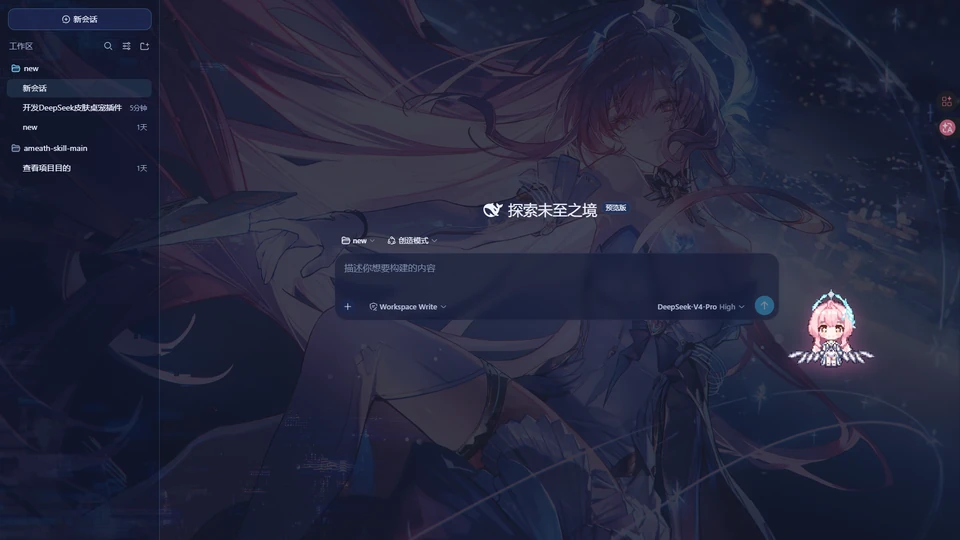</td>
<td align="center" valign="middle"><a href="https://github.com/hachimi-ai/dsh-aemeath">hachimi-ai/dsh-aemeath</a></td>
<td align="center" valign="middle">5</td>
</tr>
<tr>
<td align="center" valign="middle">dsh-naiwa-theme</td>
<td align="center" valign="middle">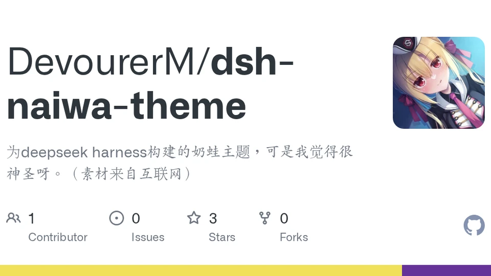</td>
<td align="center" valign="middle"><a href="https://github.com/DevourerM/dsh-naiwa-theme">DevourerM/dsh-naiwa-theme</a></td>
<td align="center" valign="middle">5</td>
</tr>
<tr>
<td align="center" valign="middle">dsh-skin-appearance</td>
<td align="center" valign="middle">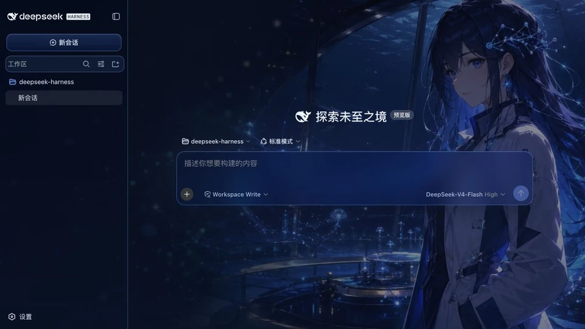</td>
<td align="center" valign="middle"><a href="https://github.com/Vim0x3c/dsh-skin-appearance">Vim0x3c/dsh-skin-appearance</a></td>
<td align="center" valign="middle">5</td>
</tr>
<tr>
<td align="center" valign="middle">dsh-wallpaper-engine</td>
<td align="center" valign="middle">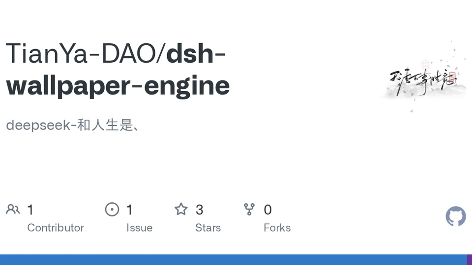</td>
<td align="center" valign="middle"><a href="https://github.com/TianYa-DAO/dsh-wallpaper-engine">TianYa-DAO/dsh-wallpaper-engine</a></td>
<td align="center" valign="middle">5</td>
</tr>
<tr>
<td align="center" valign="middle">dsh-neu-theme</td>
<td align="center" valign="middle">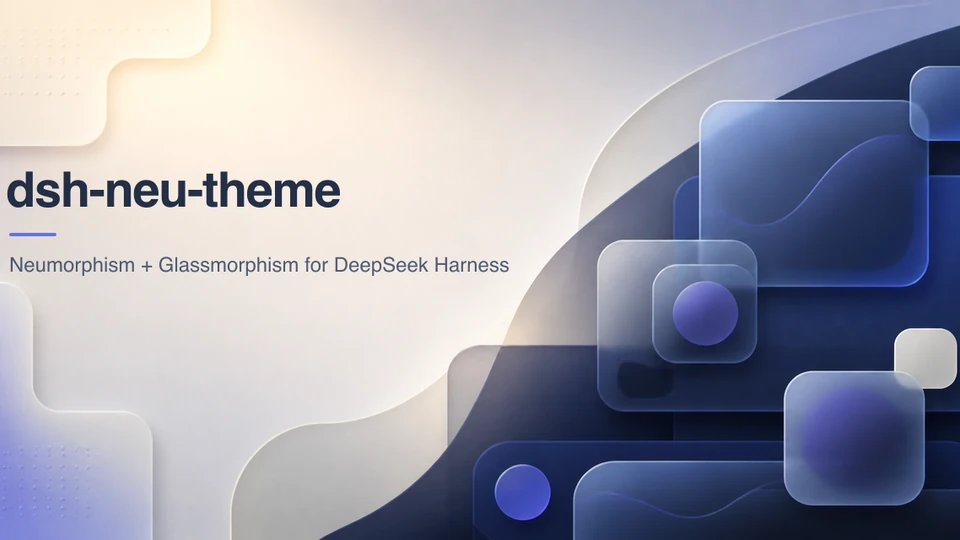</td>
<td align="center" valign="middle"><a href="https://github.com/Lhy723/dsh-neu-theme">Lhy723/dsh-neu-theme</a></td>
<td align="center" valign="middle">4</td>
</tr>
<tr>
<td align="center" valign="middle">dsh-outdoor-theme</td>
<td align="center" valign="middle">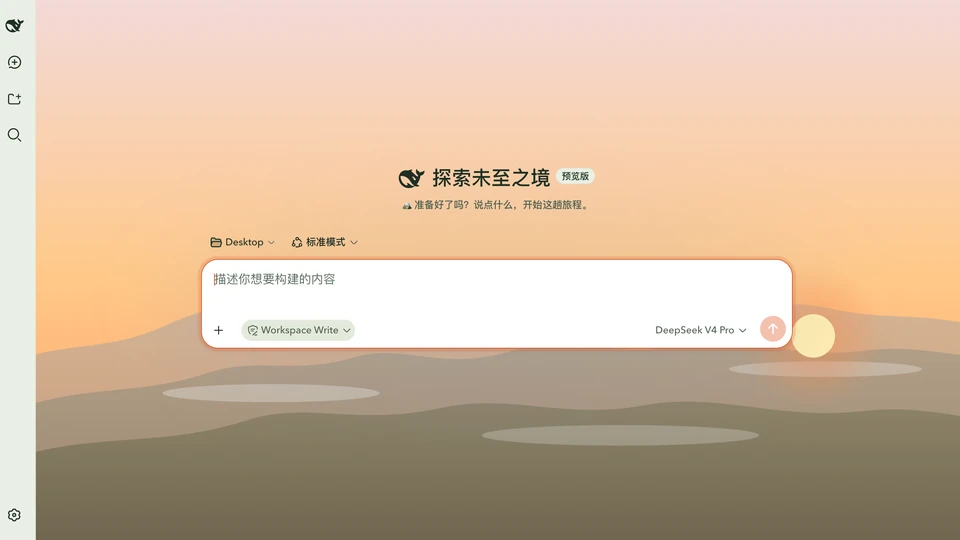</td>
<td align="center" valign="middle"><a href="https://github.com/Estellalee/dsh-outdoor-theme">Estellalee/dsh-outdoor-theme</a></td>
<td align="center" valign="middle">4</td>
</tr>
<tr>
<td align="center" valign="middle">dsh-skin-claude-code</td>
<td align="center" valign="middle">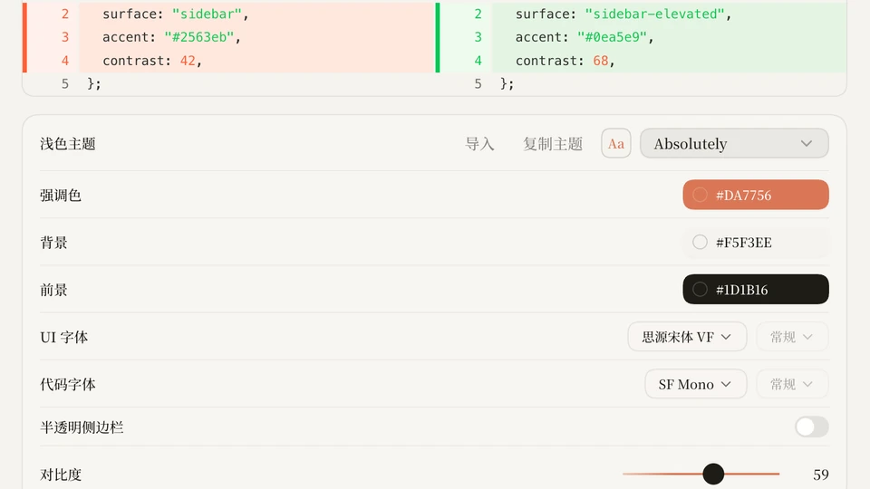</td>
<td align="center" valign="middle"><a href="https://github.com/le-soleil-se-couche/dsh-skin-claude-code">le-soleil-se-couche/dsh-skin-claude-code</a></td>
<td align="center" valign="middle">4</td>
</tr>
<tr>
<td align="center" valign="middle">dsh-theme-neko</td>
<td align="center" valign="middle">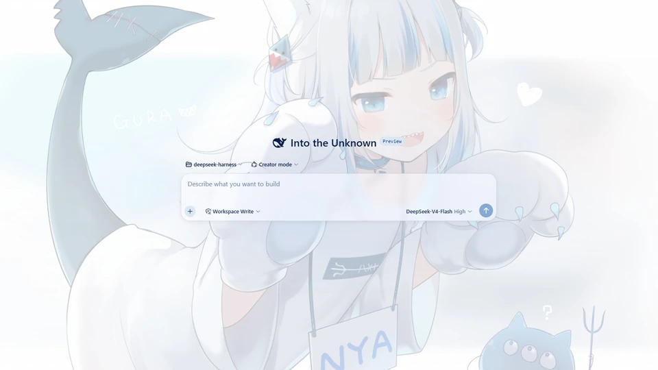</td>
<td align="center" valign="middle"><a href="https://github.com/drfccv/dsh-theme-neko">drfccv/dsh-theme-neko</a></td>
<td align="center" valign="middle">4</td>
</tr>
<tr>
<td align="center" valign="middle">dsh-webUI-Glass-Theme</td>
<td align="center" valign="middle">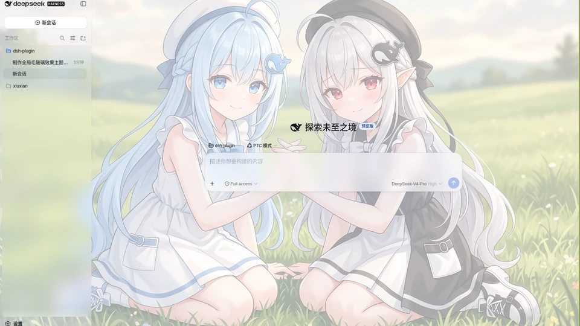</td>
<td align="center" valign="middle"><a href="https://github.com/makuralymi/dsh-webUI-Glass-Theme">makuralymi/dsh-webUI-Glass-Theme</a></td>
<td align="center" valign="middle">4</td>
</tr>
<tr>
<td align="center" valign="middle">Solarized-dsh-theme</td>
<td align="center" valign="middle">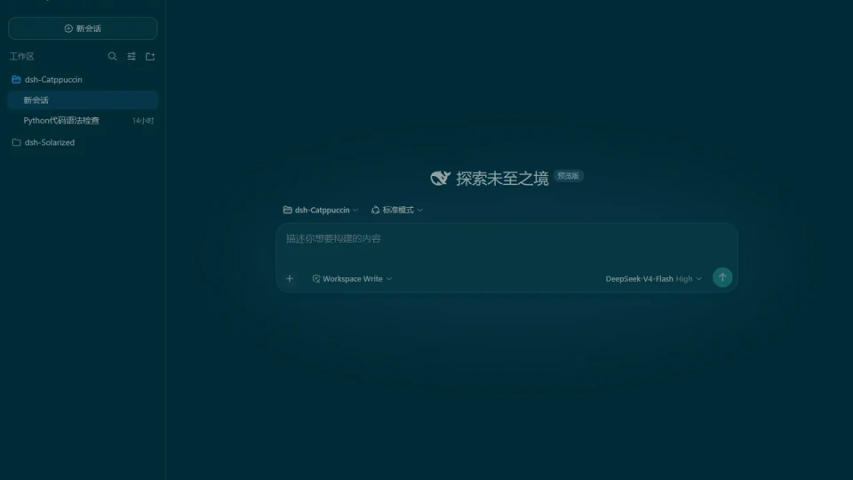</td>
<td align="center" valign="middle"><a href="https://github.com/zhijun-dai/Solarized-dsh-theme">zhijun-dai/Solarized-dsh-theme</a></td>
<td align="center" valign="middle">4</td>
</tr>
<tr>
<td align="center" valign="middle">dph-endfield-theme</td>
<td align="center" valign="middle">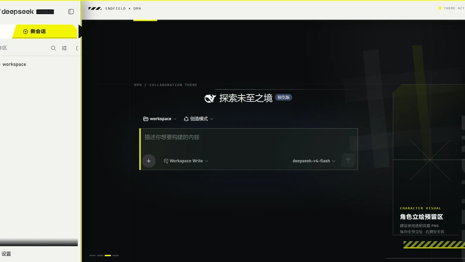</td>
<td align="center" valign="middle"><a href="https://github.com/thjyy/dph-endfield-theme">thjyy/dph-endfield-theme</a></td>
<td align="center" valign="middle">3</td>
</tr>
<tr>
<td align="center" valign="middle">dsh-background</td>
<td align="center" valign="middle">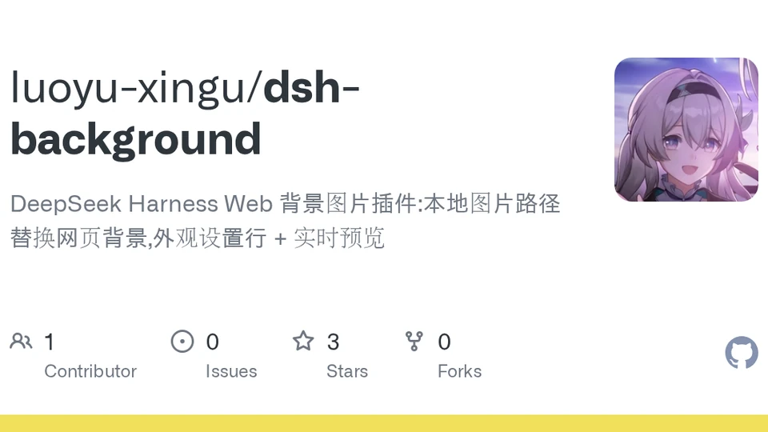</td>
<td align="center" valign="middle"><a href="https://github.com/luoyu-xingu/dsh-background">luoyu-xingu/dsh-background</a></td>
<td align="center" valign="middle">3</td>
</tr>
<tr>
<td align="center" valign="middle">dsh-background-plugin</td>
<td align="center" valign="middle">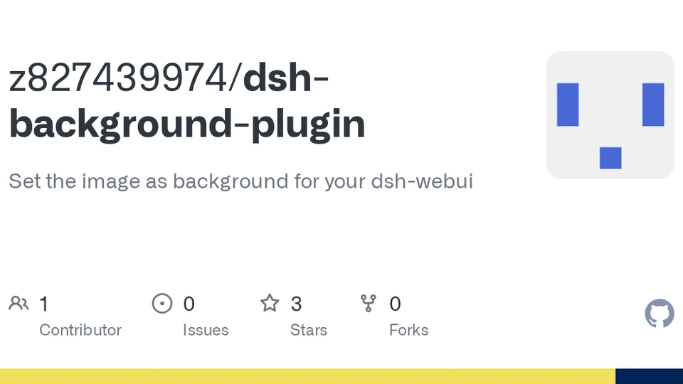</td>
<td align="center" valign="middle"><a href="https://github.com/z827439974/dsh-background-plugin">z827439974/dsh-background-plugin</a></td>
<td align="center" valign="middle">3</td>
</tr>
<tr>
<td align="center" valign="middle">dsh-billing-glass</td>
<td align="center" valign="middle">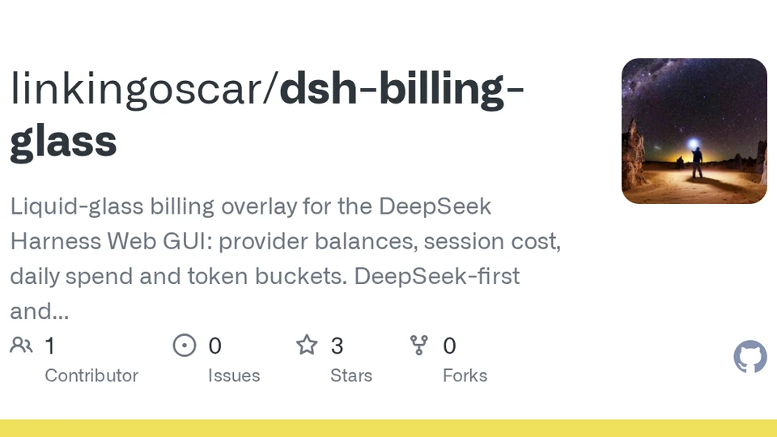</td>
<td align="center" valign="middle"><a href="https://github.com/linkingoscar/dsh-billing-glass">linkingoscar/dsh-billing-glass</a></td>
<td align="center" valign="middle">3</td>
</tr>
<tr>
<td align="center" valign="middle">dsh-cyberpunk-theme</td>
<td align="center" valign="middle">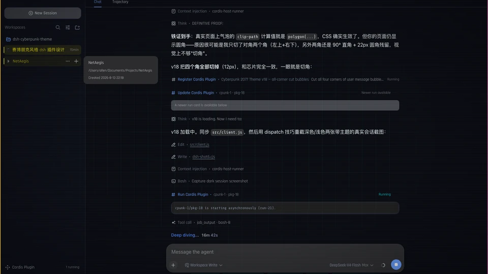</td>
<td align="center" valign="middle"><a href="https://github.com/ai7603/dsh-cyberpunk-theme">ai7603/dsh-cyberpunk-theme</a></td>
<td align="center" valign="middle">3</td>
</tr>
<tr>
<td align="center" valign="middle">dsh-fun-weather</td>
<td align="center" valign="middle">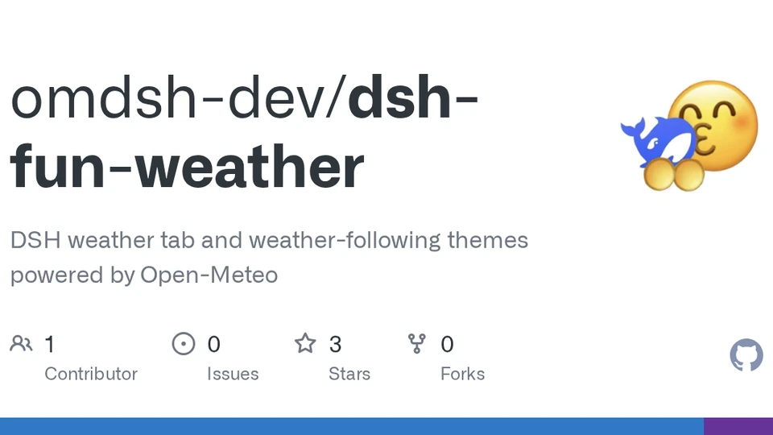</td>
<td align="center" valign="middle"><a href="https://github.com/omdsh-dev/dsh-fun-weather">omdsh-dev/dsh-fun-weather</a></td>
<td align="center" valign="middle">3</td>
</tr>
<tr>
<td align="center" valign="middle">dsh-neo-skin</td>
<td align="center" valign="middle">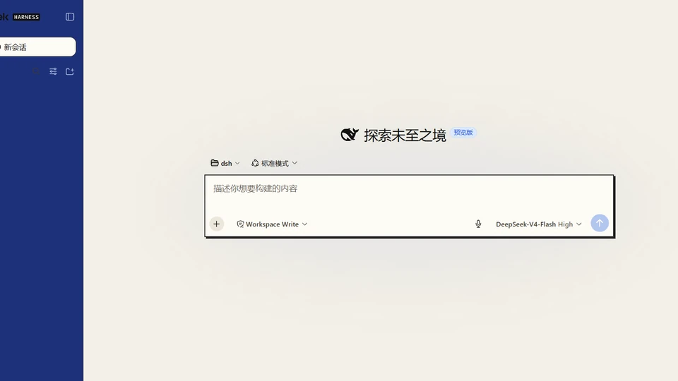</td>
<td align="center" valign="middle"><a href="https://github.com/0nt-one/dsh-neo-skin">0nt-one/dsh-neo-skin</a></td>
<td align="center" valign="middle">3</td>
</tr>
<tr>
<td align="center" valign="middle">dsh-pet</td>
<td align="center" valign="middle">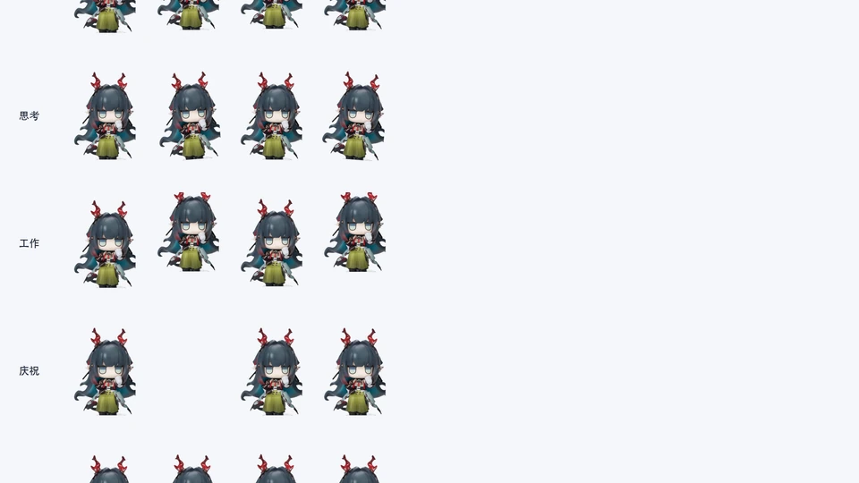</td>
<td align="center" valign="middle"><a href="https://github.com/zealot00/dsh-pet">zealot00/dsh-pet</a></td>
<td align="center" valign="middle">3</td>
</tr>
<tr>
<td align="center" valign="middle">dsh-qq2007-skin</td>
<td align="center" valign="middle"></td>
<td align="center" valign="middle"><a href="https://github.com/LeemanCheung/dsh-qq2007-skin">LeemanCheung/dsh-qq2007-skin</a></td>
<td align="center" valign="middle">3</td>
</tr>
<tr>
<td align="center" valign="middle">dsh-skin-blue-whale</td>
<td align="center" valign="middle">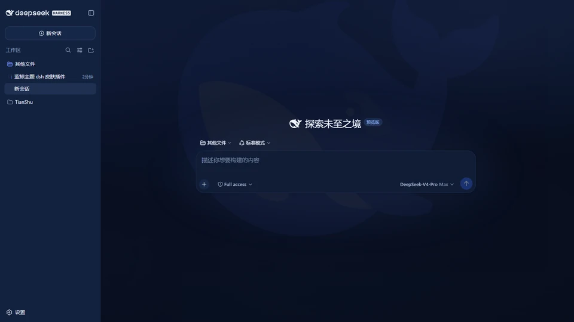</td>
<td align="center" valign="middle"><a href="https://github.com/zenghuizhu69-hub/dsh-skin-blue-whale">zenghuizhu69-hub/dsh-skin-blue-whale</a></td>
<td align="center" valign="middle">3</td>
</tr>
<tr>
<td align="center" valign="middle">dsh-skin-toggle</td>
<td align="center" valign="middle">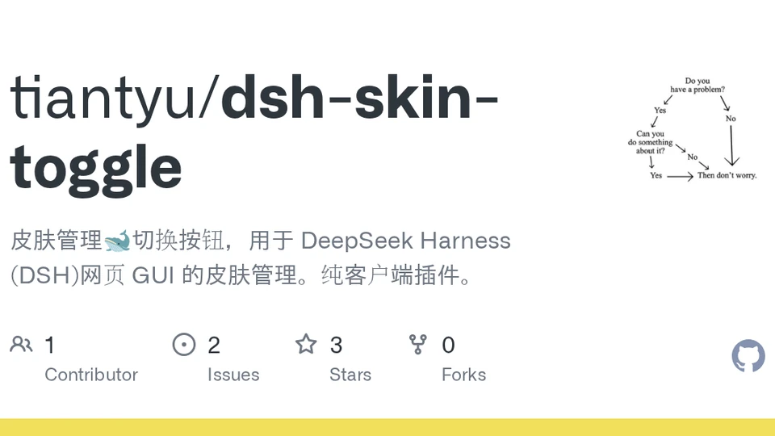</td>
<td align="center" valign="middle"><a href="https://github.com/tiantyu/dsh-skin-toggle">tiantyu/dsh-skin-toggle</a></td>
<td align="center" valign="middle">3</td>
</tr>
<tr>
<td align="center" valign="middle">dsh-theme-plugin</td>
<td align="center" valign="middle">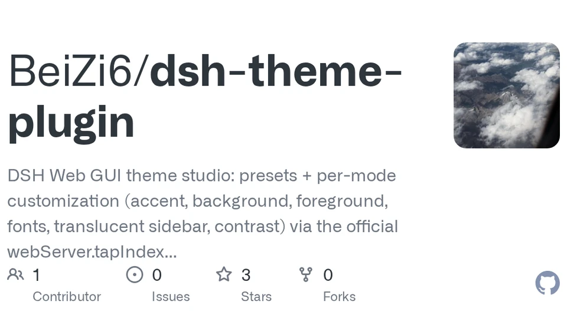</td>
<td align="center" valign="middle"><a href="https://github.com/BeiZi6/dsh-theme-plugin">BeiZi6/dsh-theme-plugin</a></td>
<td align="center" valign="middle">3</td>
</tr>
<tr>
<td align="center" valign="middle">dsh-wallpaper</td>
<td align="center" valign="middle">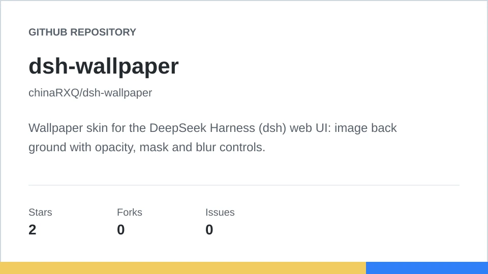</td>
<td align="center" valign="middle"><a href="https://github.com/chinaRXQ/dsh-wallpaper">chinaRXQ/dsh-wallpaper</a></td>
<td align="center" valign="middle">3</td>
</tr>
<tr>
<td align="center" valign="middle">dsh-web-theme-packs</td>
<td align="center" valign="middle">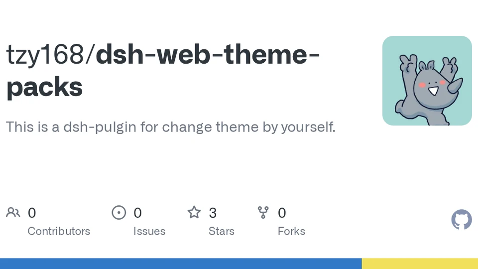</td>
<td align="center" valign="middle"><a href="https://github.com/tzy168/dsh-web-theme-packs">tzy168/dsh-web-theme-packs</a></td>
<td align="center" valign="middle">3</td>
</tr>
<tr>
<td align="center" valign="middle">dsh-wx-skin</td>
<td align="center" valign="middle">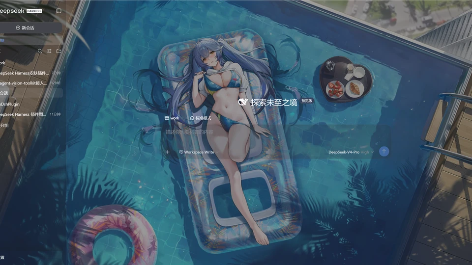</td>
<td align="center" valign="middle"><a href="https://github.com/wangxilhy23/dsh-wx-skin">wangxilhy23/dsh-wx-skin</a></td>
<td align="center" valign="middle">3</td>
</tr>
<tr>
<td align="center" valign="middle">silk-background</td>
<td align="center" valign="middle">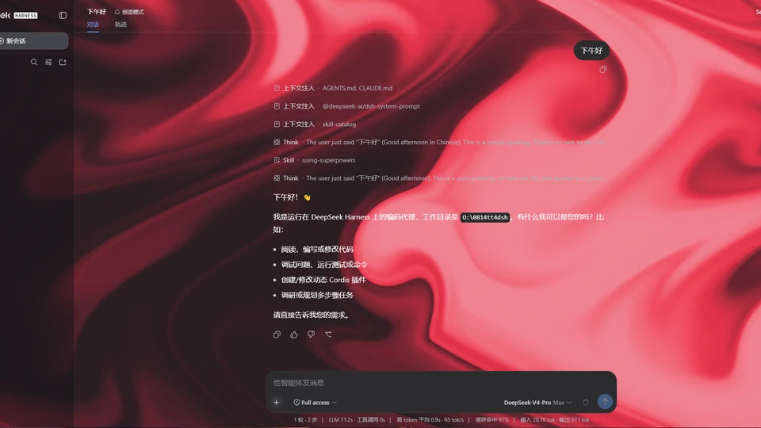</td>
<td align="center" valign="middle"><a href="https://github.com/z21for99/silk-background">z21for99/silk-background</a></td>
<td align="center" valign="middle">3</td>
</tr>
<tr>
<td align="center" valign="middle">chiral-pulse</td>
<td align="center" valign="middle">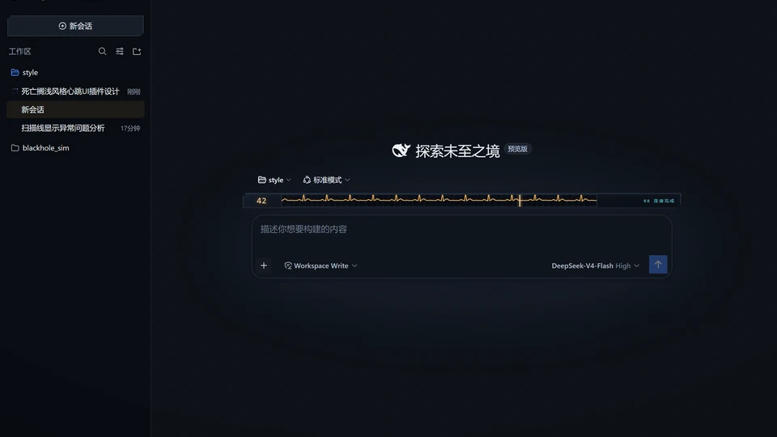</td>
<td align="center" valign="middle"><a href="https://github.com/MoonShadow1976/chiral-pulse">MoonShadow1976/chiral-pulse</a></td>
<td align="center" valign="middle">2</td>
</tr>
<tr>
<td align="center" valign="middle">deepseek-harness-custom-background</td>
<td align="center" valign="middle"></td>
<td align="center" valign="middle"><a href="https://github.com/vonPaulison/deepseek-harness-custom-background">vonPaulison/deepseek-harness-custom-background</a></td>
<td align="center" valign="middle">2</td>
</tr>
<tr>
<td align="center" valign="middle">DeepSeek-Harness-yizi-themes</td>
<td align="center" valign="middle">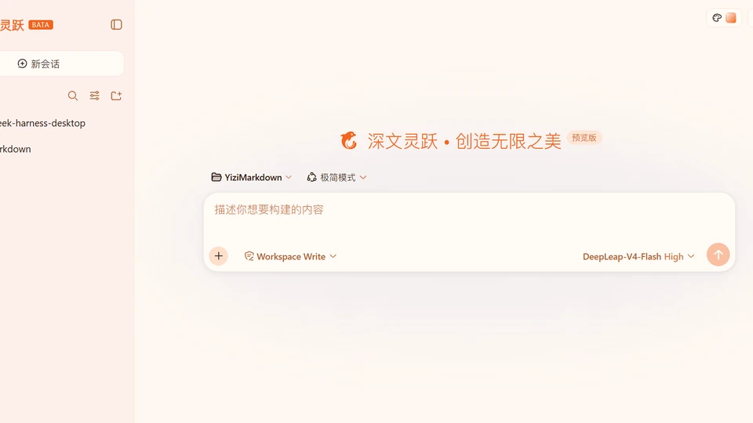</td>
<td align="center" valign="middle"><a href="https://github.com/laoduu/DeepSeek-Harness-yizi-themes">laoduu/DeepSeek-Harness-yizi-themes</a></td>
<td align="center" valign="middle">2</td>
</tr>
<tr>
<td align="center" valign="middle">dsh-arcaea-theme</td>
<td align="center" valign="middle">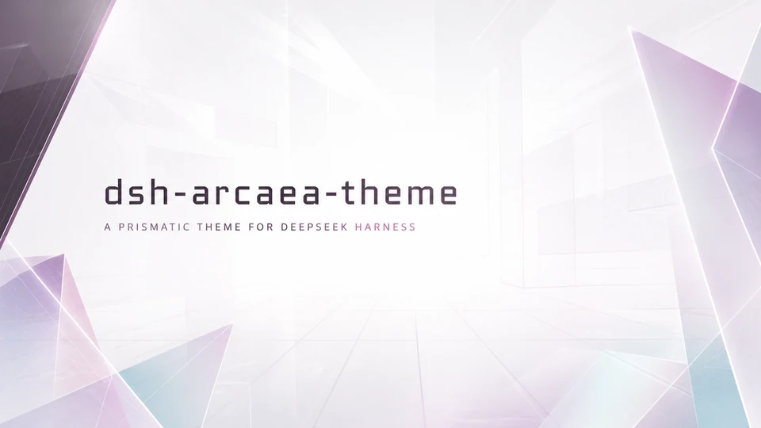</td>
<td align="center" valign="middle"><a href="https://github.com/a1swg1159-pixel/dsh-arcaea-theme">a1swg1159-pixel/dsh-arcaea-theme</a></td>
<td align="center" valign="middle">2</td>
</tr>
<tr>
<td align="center" valign="middle">dsh-claude-theme</td>
<td align="center" valign="middle">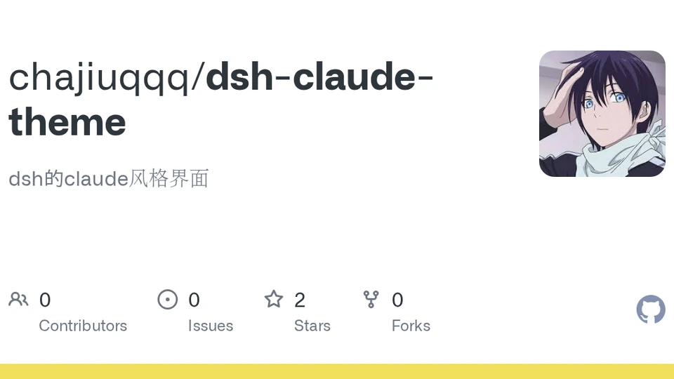</td>
<td align="center" valign="middle"><a href="https://github.com/chajiuqqq/dsh-claude-theme">chajiuqqq/dsh-claude-theme</a></td>
<td align="center" valign="middle">2</td>
</tr>
<tr>
<td align="center" valign="middle">dsh-eva-theme-plugin</td>
<td align="center" valign="middle">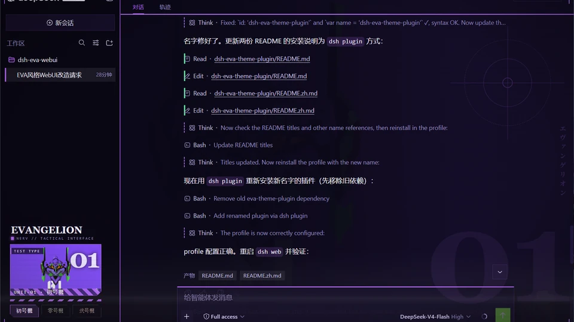</td>
<td align="center" valign="middle"><a href="https://github.com/oceanxuikun/dsh-eva-theme-plugin">oceanxuikun/dsh-eva-theme-plugin</a></td>
<td align="center" valign="middle">2</td>
</tr>
<tr>
<td align="center" valign="middle">dsh-eye-care</td>
<td align="center" valign="middle">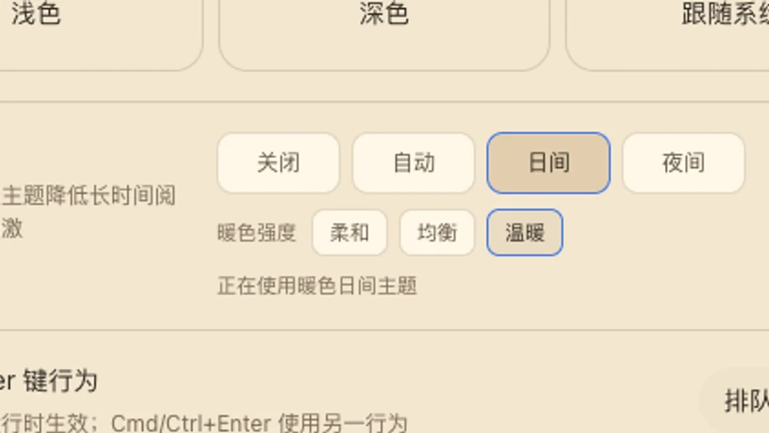</td>
<td align="center" valign="middle"><a href="https://github.com/Anionex/dsh-eye-care">Anionex/dsh-eye-care</a></td>
<td align="center" valign="middle">2</td>
</tr>
<tr>
<td align="center" valign="middle">dsh-image-theme</td>
<td align="center" valign="middle">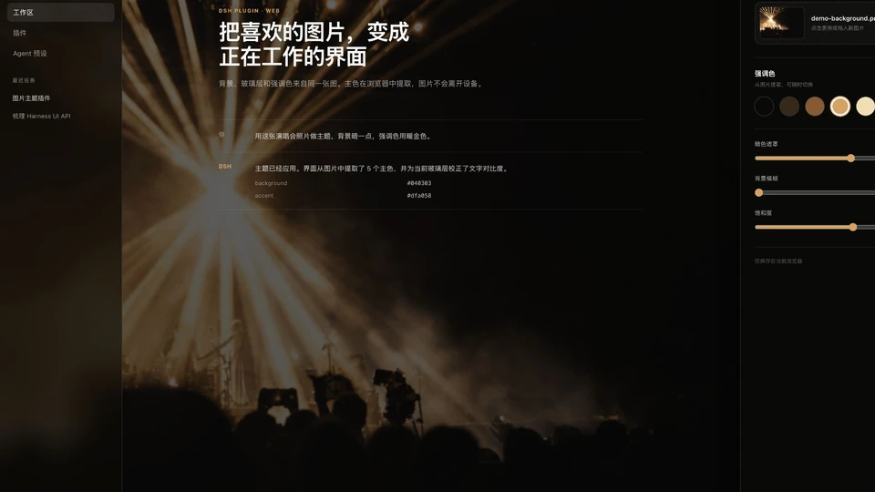</td>
<td align="center" valign="middle"><a href="https://github.com/Carpon39038/dsh-image-theme">Carpon39038/dsh-image-theme</a></td>
<td align="center" valign="middle">2</td>
</tr>
<tr>
<td align="center" valign="middle">dsh-plugin-image-wallpaper</td>
<td align="center" valign="middle">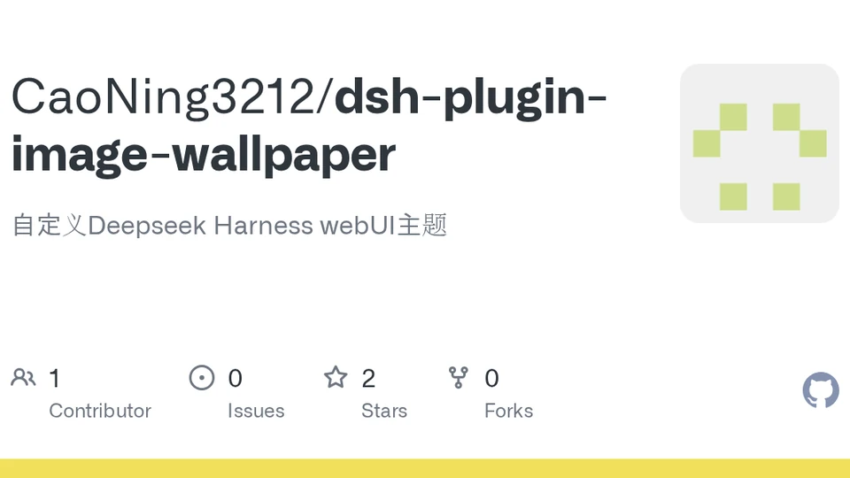</td>
<td align="center" valign="middle"><a href="https://github.com/CaoNing3212/dsh-plugin-image-wallpaper">CaoNing3212/dsh-plugin-image-wallpaper</a></td>
<td align="center" valign="middle">2</td>
</tr>
<tr>
<td align="center" valign="middle">dsh-skin</td>
<td align="center" valign="middle">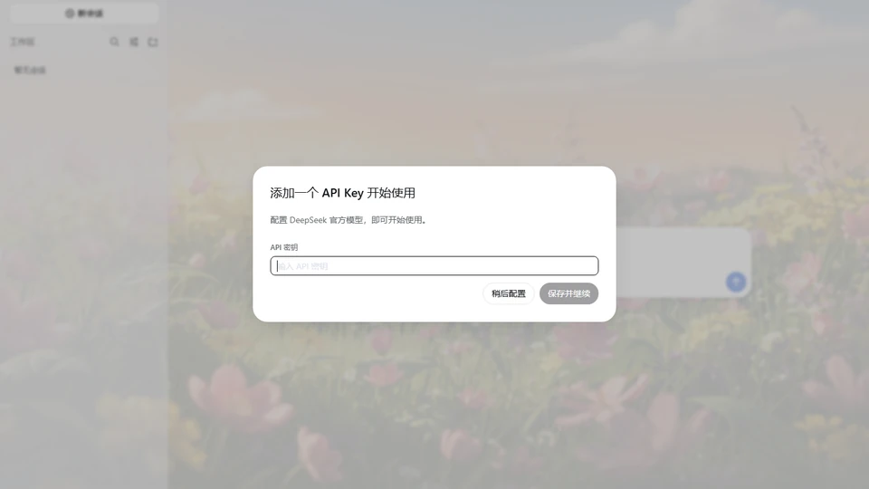</td>
<td align="center" valign="middle"><a href="https://github.com/sakka6868/dsh-skin">sakka6868/dsh-skin</a></td>
<td align="center" valign="middle">2</td>
</tr>
<tr>
<td align="center" valign="middle">dsh-skin-amis</td>
<td align="center" valign="middle">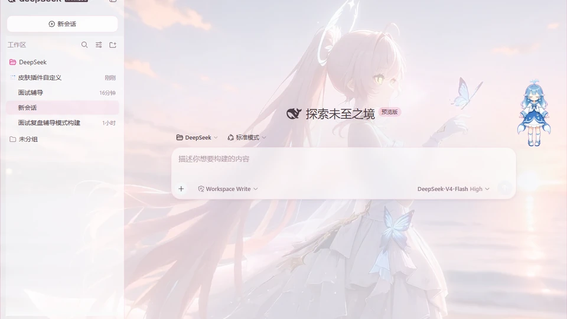</td>
<td align="center" valign="middle"><a href="https://github.com/wanzhiwei5/dsh-skin-amis">wanzhiwei5/dsh-skin-amis</a></td>
<td align="center" valign="middle">2</td>
</tr>
<tr>
<td align="center" valign="middle">dsh-theme-colorizer</td>
<td align="center" valign="middle">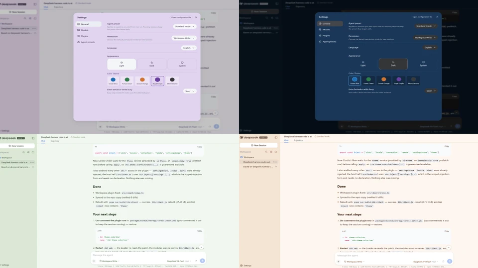</td>
<td align="center" valign="middle"><a href="https://github.com/RealHacker/dsh-theme-colorizer">RealHacker/dsh-theme-colorizer</a></td>
<td align="center" valign="middle">2</td>
</tr>
<tr>
<td align="center" valign="middle">dsh-theme-cyberpunk</td>
<td align="center" valign="middle">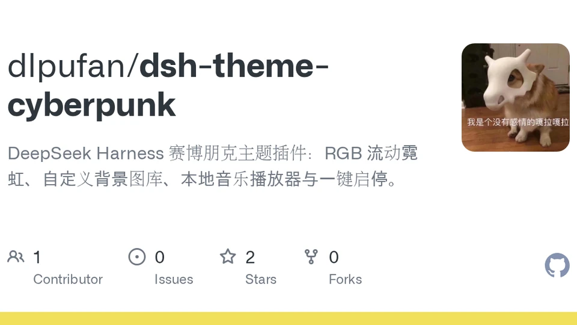</td>
<td align="center" valign="middle"><a href="https://github.com/dlpufan/dsh-theme-cyberpunk">dlpufan/dsh-theme-cyberpunk</a></td>
<td align="center" valign="middle">2</td>
</tr>
<tr>
<td align="center" valign="middle">dsh-thought-buddy</td>
<td align="center" valign="middle">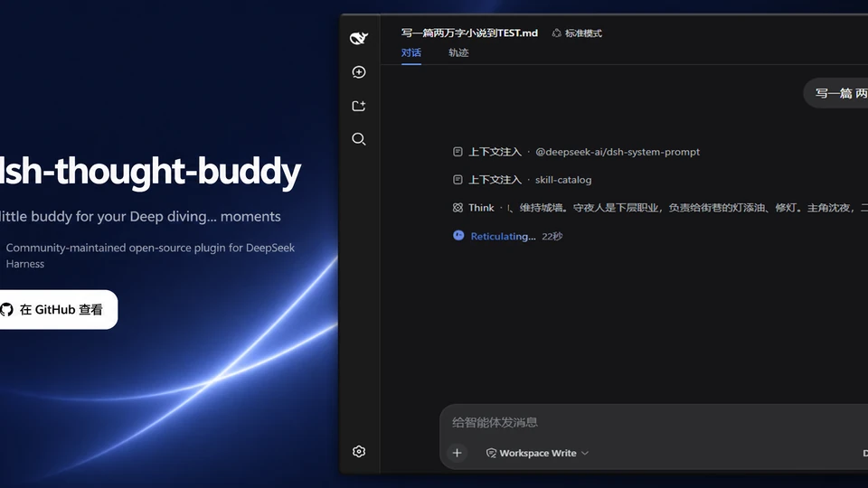</td>
<td align="center" valign="middle"><a href="https://github.com/dsh-plugins/dsh-thought-buddy">dsh-plugins/dsh-thought-buddy</a></td>
<td align="center" valign="middle">2</td>
</tr>
<tr>
<td align="center" valign="middle">liuli-theme</td>
<td align="center" valign="middle">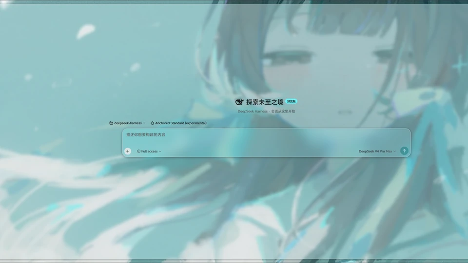</td>
<td align="center" valign="middle"><a href="https://github.com/LilycleHeart/liuli-theme">LilycleHeart/liuli-theme</a></td>
<td align="center" valign="middle">2</td>
</tr>
<tr>
<td align="center" valign="middle">pramanix-eyjafjalla</td>
<td align="center" valign="middle">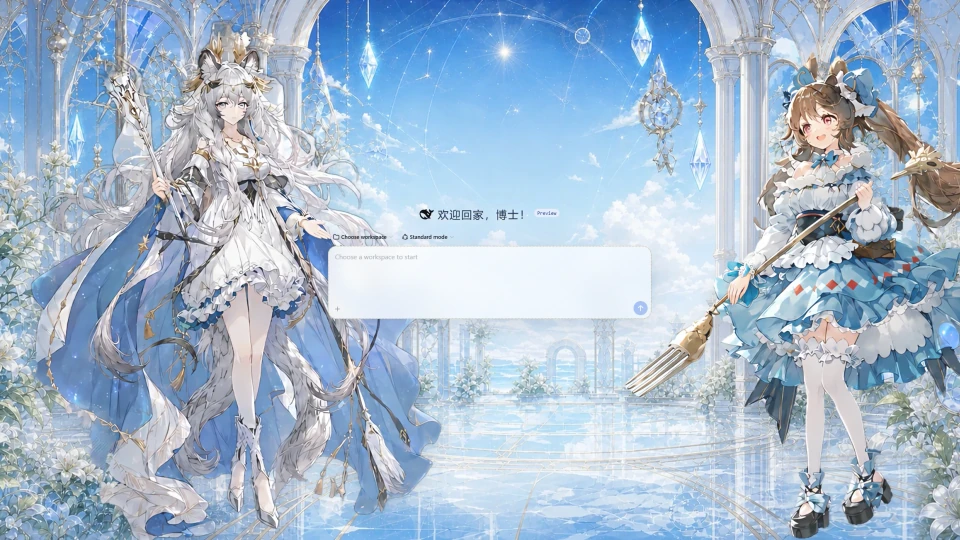</td>
<td align="center" valign="middle"><a href="https://github.com/DocJlm/dsh-arknights">DocJlm/dsh-arknights</a></td>
<td align="center" valign="middle">2</td>
</tr>
<tr>
<td align="center" valign="middle">claude-parchment-theme</td>
<td align="center" valign="middle">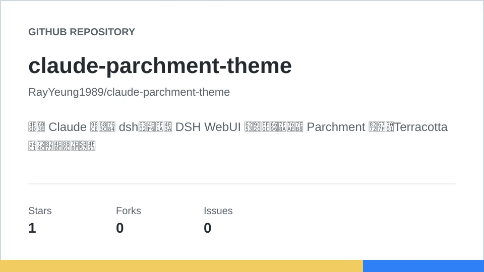</td>
<td align="center" valign="middle"><a href="https://github.com/RayYeung1989/claude-parchment-theme">RayYeung1989/claude-parchment-theme</a></td>
<td align="center" valign="middle">1</td>
</tr>
<tr>
<td align="center" valign="middle">dhs-theme-plugin</td>
<td align="center" valign="middle">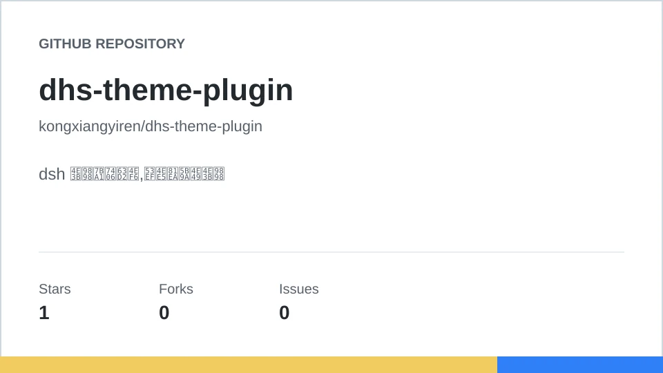</td>
<td align="center" valign="middle"><a href="https://github.com/kongxiangyiren/dhs-theme-plugin">kongxiangyiren/dhs-theme-plugin</a></td>
<td align="center" valign="middle">1</td>
</tr>
<tr>
<td align="center" valign="middle">dsh-blue-archive-shiroko</td>
<td align="center" valign="middle"></td>
<td align="center" valign="middle"><a href="https://github.com/mldhao/dsh-blue-archive-shiroko">mldhao/dsh-blue-archive-shiroko</a></td>
<td align="center" valign="middle">1</td>
</tr>
<tr>
<td align="center" valign="middle">dsh-client-ui-m3-theme</td>
<td align="center" valign="middle">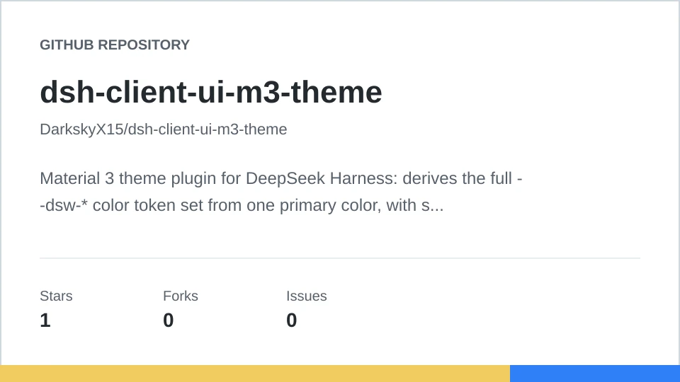</td>
<td align="center" valign="middle"><a href="https://github.com/DarkskyX15/dsh-client-ui-m3-theme">DarkskyX15/dsh-client-ui-m3-theme</a></td>
<td align="center" valign="middle">1</td>
</tr>
<tr>
<td align="center" valign="middle">dsh-dracula</td>
<td align="center" valign="middle">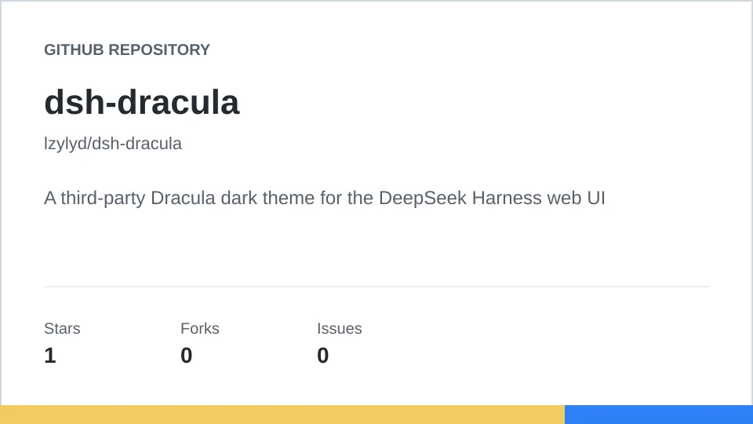</td>
<td align="center" valign="middle"><a href="https://github.com/lzylyd/dsh-dracula">lzylyd/dsh-dracula</a></td>
<td align="center" valign="middle">1</td>
</tr>
<tr>
<td align="center" valign="middle">dsh-extensions-wallpaperskin</td>
<td align="center" valign="middle">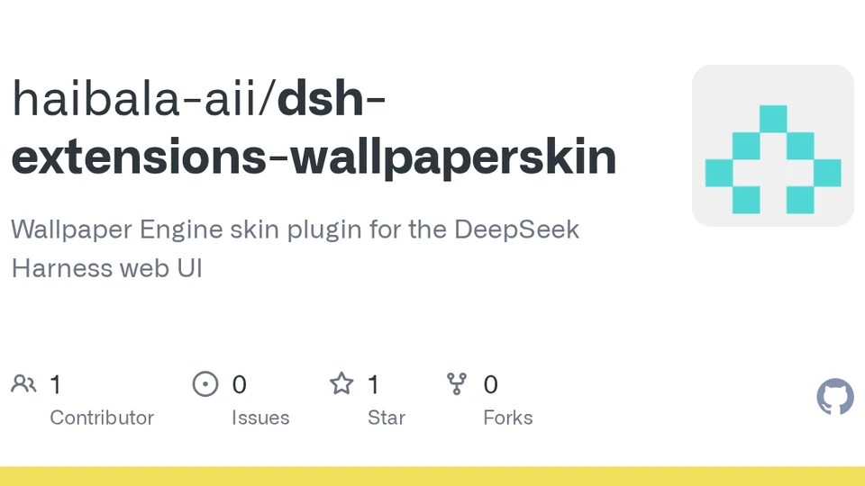</td>
<td align="center" valign="middle"><a href="https://github.com/haibala-aii/dsh-extensions-wallpaperskin">haibala-aii/dsh-extensions-wallpaperskin</a></td>
<td align="center" valign="middle">1</td>
</tr>
<tr>
<td align="center" valign="middle">dsh-frosted-window</td>
<td align="center" valign="middle">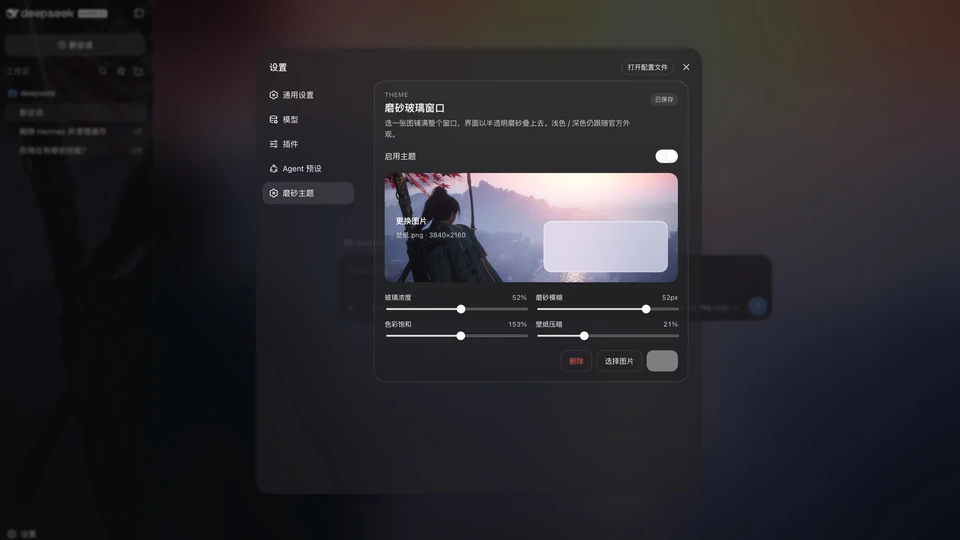</td>
<td align="center" valign="middle"><a href="https://github.com/SenryLee/dsh-frosted-window">SenryLee/dsh-frosted-window</a></td>
<td align="center" valign="middle">1</td>
</tr>
<tr>
<td align="center" valign="middle">dsh-gif-background</td>
<td align="center" valign="middle">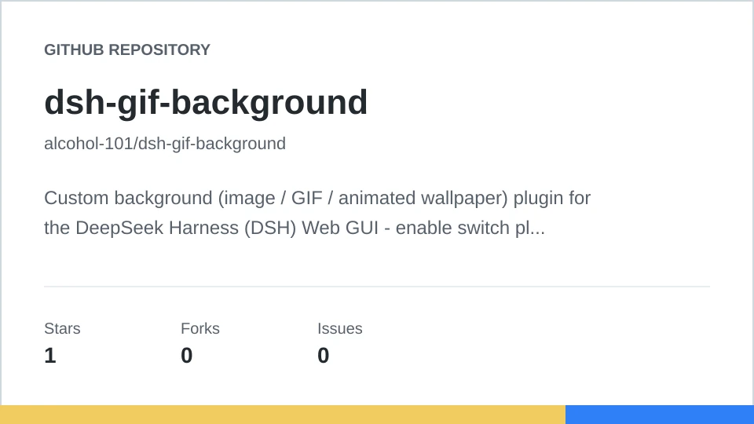</td>
<td align="center" valign="middle"><a href="https://github.com/alcohol-101/dsh-gif-background">alcohol-101/dsh-gif-background</a></td>
<td align="center" valign="middle">1</td>
</tr>
<tr>
<td align="center" valign="middle">dsh-homepage-skin</td>
<td align="center" valign="middle">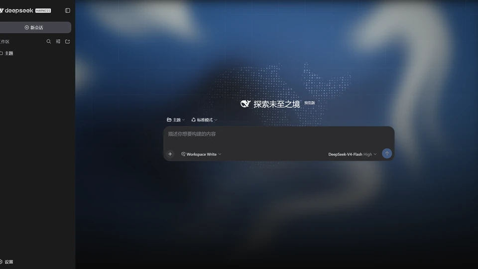</td>
<td align="center" valign="middle"><a href="https://github.com/yushi-xxh/dsh-homepage-skin">yushi-xxh/dsh-homepage-skin</a></td>
<td align="center" valign="middle">1</td>
</tr>
<tr>
<td align="center" valign="middle">dsh-image-skin</td>
<td align="center" valign="middle">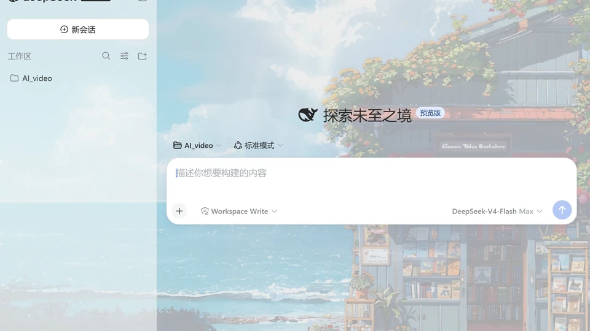</td>
<td align="center" valign="middle"><a href="https://github.com/Jack-sun-learner/dsh-image-skin">Jack-sun-learner/dsh-image-skin</a></td>
<td align="center" valign="middle">1</td>
</tr>
<tr>
<td align="center" valign="middle">dsh-ivory</td>
<td align="center" valign="middle">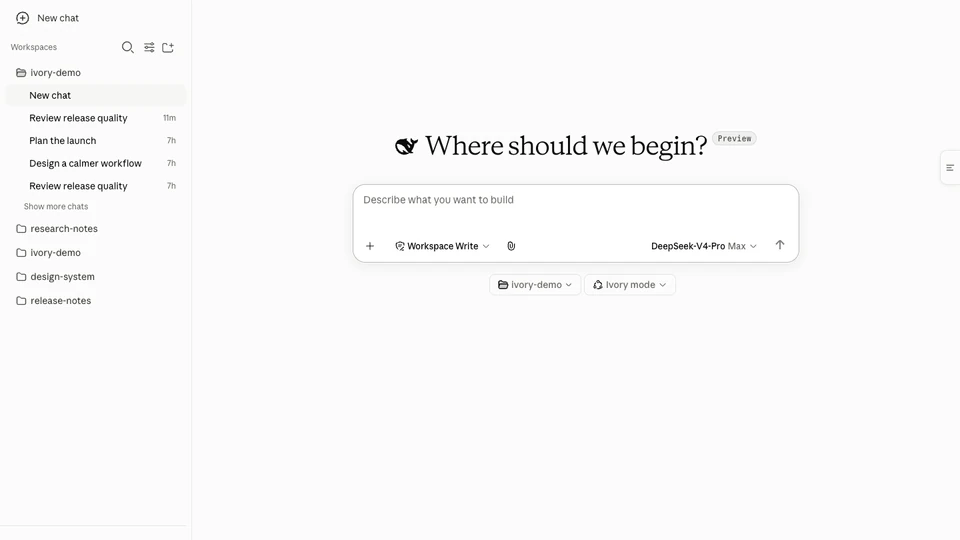</td>
<td align="center" valign="middle"><a href="https://github.com/ZJUZhiyuCai/dsh-ivory">ZJUZhiyuCai/dsh-ivory</a></td>
<td align="center" valign="middle">1</td>
</tr>
<tr>
<td align="center" valign="middle">dsh-krill-theme</td>
<td align="center" valign="middle">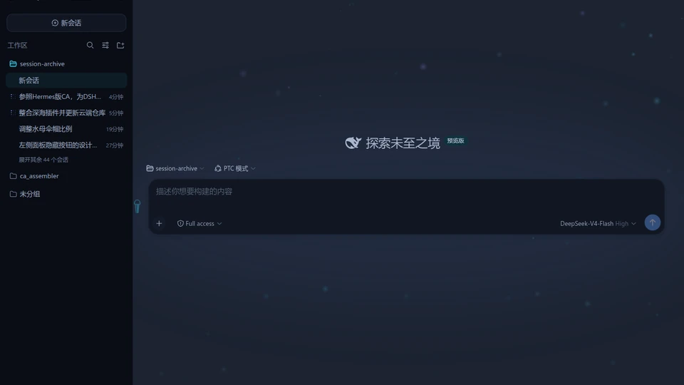</td>
<td align="center" valign="middle"><a href="https://github.com/i1j/dsh-krill-theme">i1j/dsh-krill-theme</a></td>
<td align="center" valign="middle">1</td>
</tr>
<tr>
<td align="center" valign="middle">dsh-material-you</td>
<td align="center" valign="middle">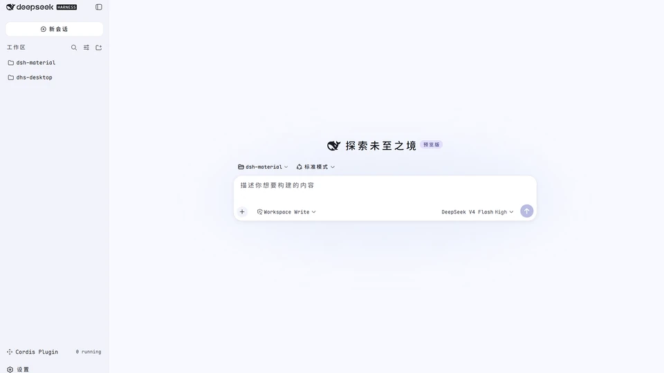</td>
<td align="center" valign="middle"><a href="https://github.com/mtaech/dsh-material-you">mtaech/dsh-material-you</a></td>
<td align="center" valign="middle">1</td>
</tr>
<tr>
<td align="center" valign="middle">dsh-matrix-theme</td>
<td align="center" valign="middle">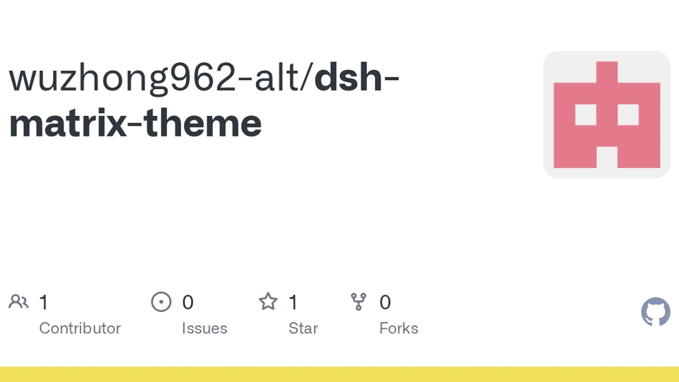</td>
<td align="center" valign="middle"><a href="https://github.com/wuzhong962-alt/dsh-matrix-theme">wuzhong962-alt/dsh-matrix-theme</a></td>
<td align="center" valign="middle">1</td>
</tr>
<tr>
<td align="center" valign="middle">dsh-plugin-gouden-leeuw-theme</td>
<td align="center" valign="middle">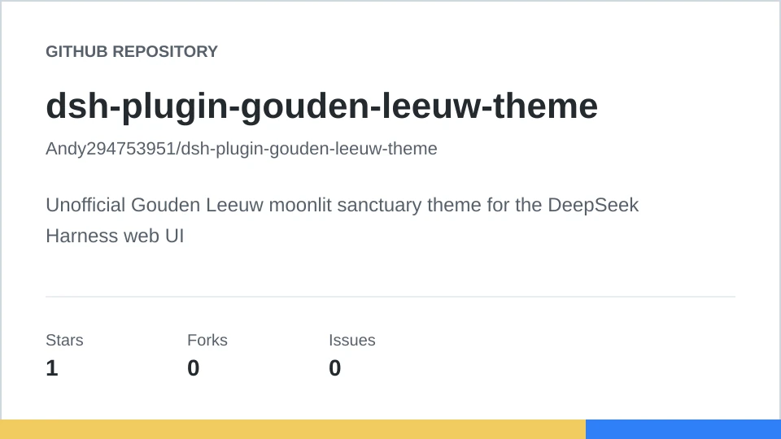</td>
<td align="center" valign="middle"><a href="https://github.com/Andy294753951/dsh-plugin-gouden-leeuw-theme">Andy294753951/dsh-plugin-gouden-leeuw-theme</a></td>
<td align="center" valign="middle">1</td>
</tr>
<tr>
<td align="center" valign="middle">dsh-theme-background-center</td>
<td align="center" valign="middle">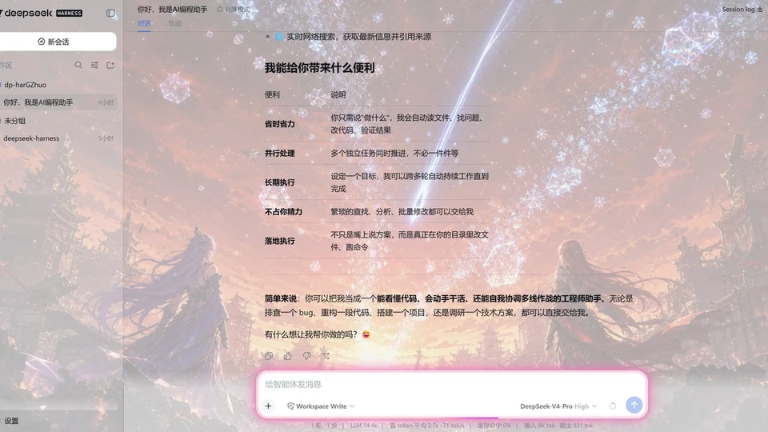</td>
<td align="center" valign="middle"><a href="https://github.com/syOPV/dsh-theme-background-center">syOPV/dsh-theme-background-center</a></td>
<td align="center" valign="middle">1</td>
</tr>
<tr>
<td align="center" valign="middle">dsh-theme-kit</td>
<td align="center" valign="middle">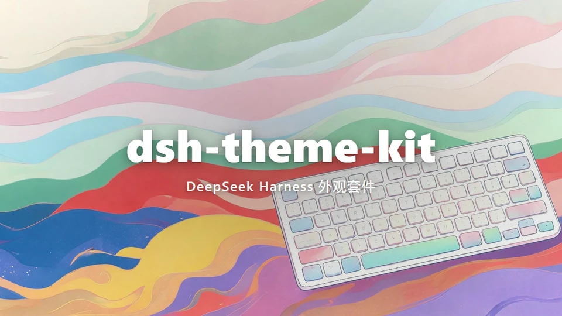</td>
<td align="center" valign="middle"><a href="https://github.com/ink5897/dsh-theme-kit">ink5897/dsh-theme-kit</a></td>
<td align="center" valign="middle">1</td>
</tr>
<tr>
<td align="center" valign="middle">dsh-theme-palettes</td>
<td align="center" valign="middle">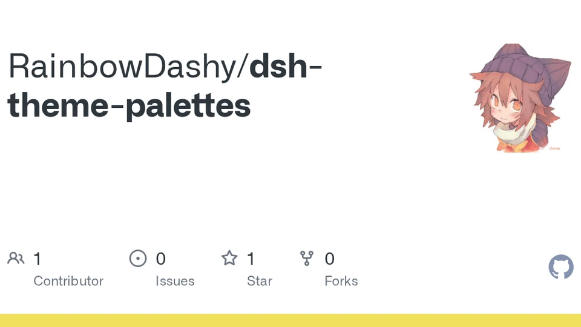</td>
<td align="center" valign="middle"><a href="https://github.com/RainbowDashy/dsh-theme-palettes">RainbowDashy/dsh-theme-palettes</a></td>
<td align="center" valign="middle">1</td>
</tr>
<tr>
<td align="center" valign="middle">dsh-theme-paper</td>
<td align="center" valign="middle">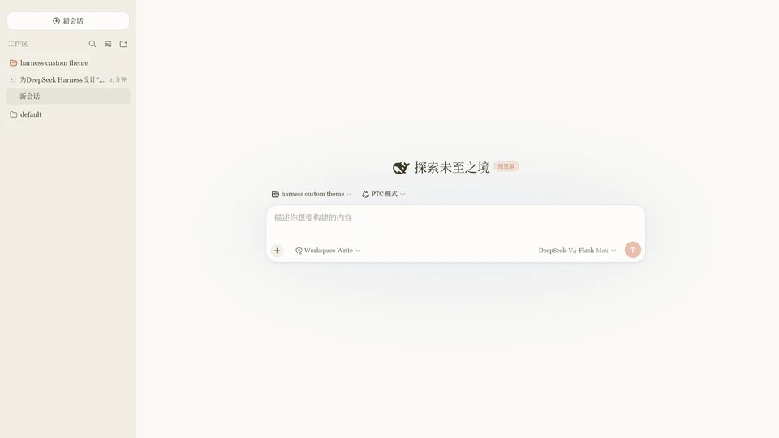</td>
<td align="center" valign="middle"><a href="https://github.com/WuWL-98/dsh-theme-paper">WuWL-98/dsh-theme-paper</a></td>
<td align="center" valign="middle">1</td>
</tr>
<tr>
<td align="center" valign="middle">dsh-theme-rheostat</td>
<td align="center" valign="middle">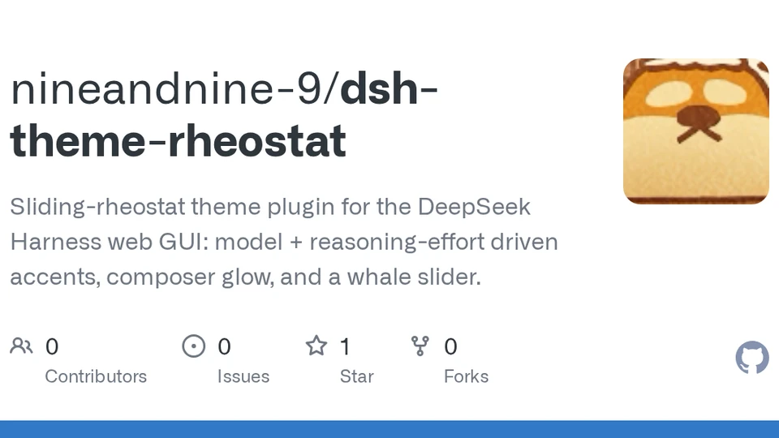</td>
<td align="center" valign="middle"><a href="https://github.com/nineandnine-9/dsh-theme-rheostat">nineandnine-9/dsh-theme-rheostat</a></td>
<td align="center" valign="middle">1</td>
</tr>
<tr>
<td align="center" valign="middle">dsh-theme-switch</td>
<td align="center" valign="middle">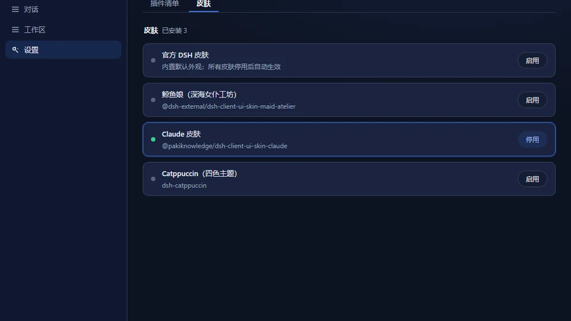</td>
<td align="center" valign="middle"><a href="https://github.com/kinmat-A/dsh-theme-switch">kinmat-A/dsh-theme-switch</a></td>
<td align="center" valign="middle">1</td>
</tr>
<tr>
<td align="center" valign="middle">dsh-theme-ti</td>
<td align="center" valign="middle">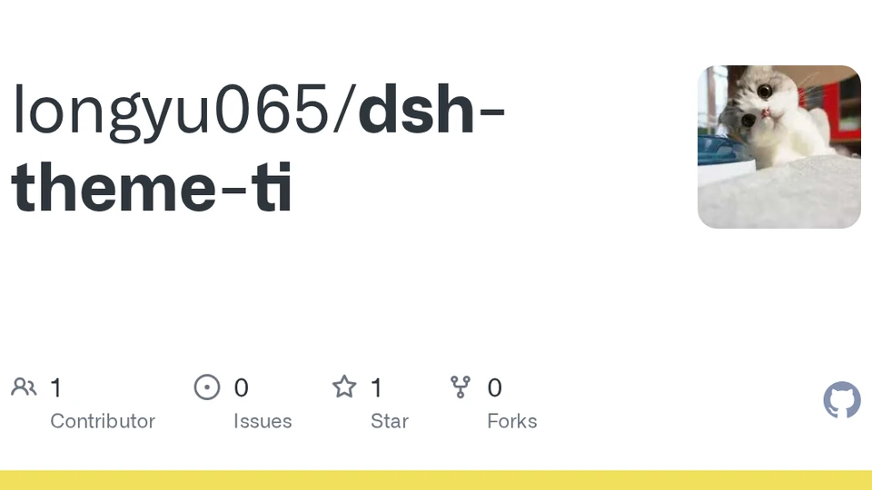</td>
<td align="center" valign="middle"><a href="https://github.com/longyu065/dsh-theme-ti">longyu065/dsh-theme-ti</a></td>
<td align="center" valign="middle">1</td>
</tr>
<tr>
<td align="center" valign="middle">dsh-themes</td>
<td align="center" valign="middle">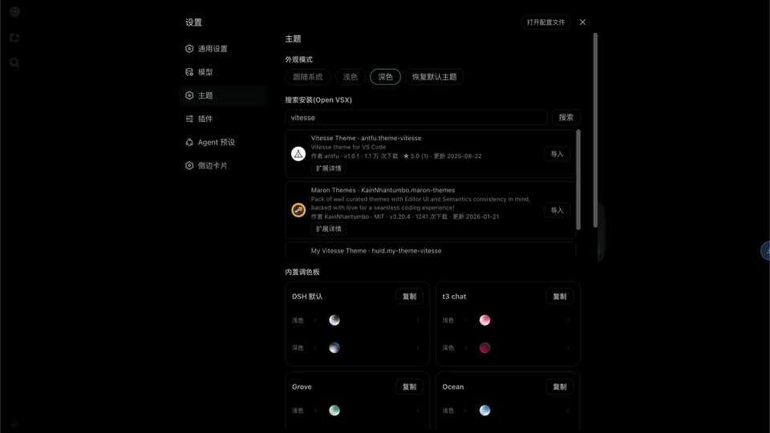</td>
<td align="center" valign="middle"><a href="https://github.com/MangMax/dsh-themes">MangMax/dsh-themes</a></td>
<td align="center" valign="middle">1</td>
</tr>
<tr>
<td align="center" valign="middle">dsh-ui-wallpaper</td>
<td align="center" valign="middle">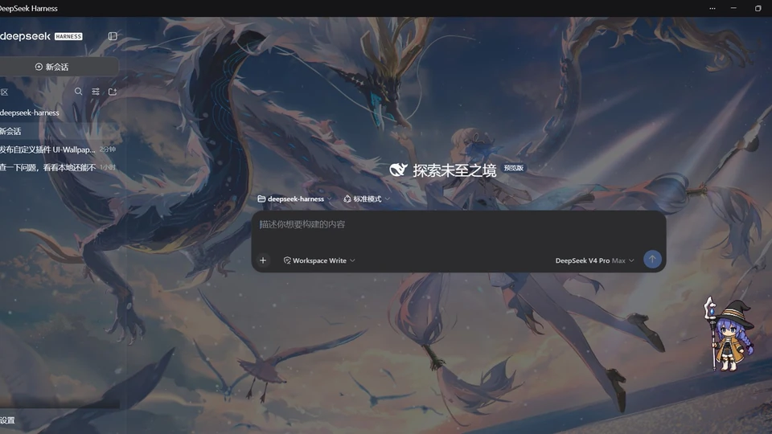</td>
<td align="center" valign="middle"><a href="https://github.com/youzhoujiMrLiu/dsh-ui-wallpaper">youzhoujiMrLiu/dsh-ui-wallpaper</a></td>
<td align="center" valign="middle">1</td>
</tr>
<tr>
<td align="center" valign="middle">dsh-vscode-theme</td>
<td align="center" valign="middle"></td>
<td align="center" valign="middle"><a href="https://github.com/Sim-xia/dsh-vscode-theme">Sim-xia/dsh-vscode-theme</a></td>
<td align="center" valign="middle">1</td>
</tr>
<tr>
<td align="center" valign="middle">dsh-whale-background</td>
<td align="center" valign="middle">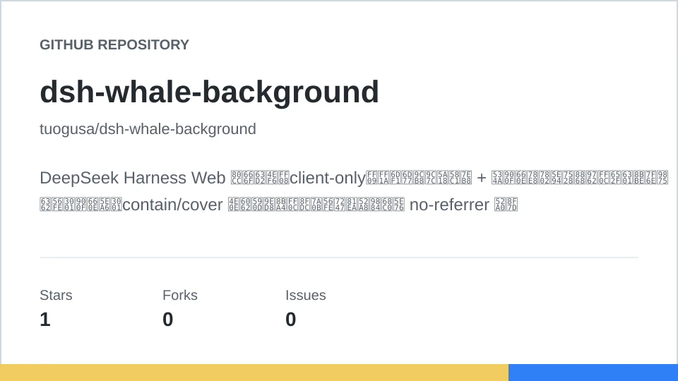</td>
<td align="center" valign="middle"><a href="https://github.com/tuogusa/dsh-whale-background">tuogusa/dsh-whale-background</a></td>
<td align="center" valign="middle">1</td>
</tr>
<tr>
<td align="center" valign="middle">dsh-whale-companion</td>
<td align="center" valign="middle">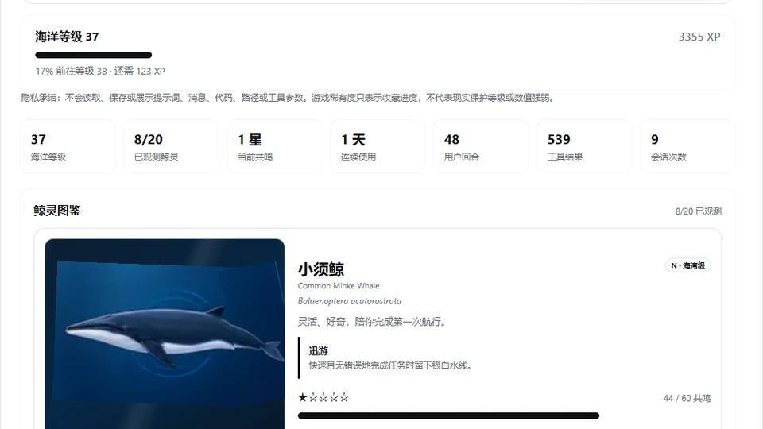</td>
<td align="center" valign="middle"><a href="https://github.com/LeemanCheung/dsh-whale-companion">LeemanCheung/dsh-whale-companion</a></td>
<td align="center" valign="middle">1</td>
</tr>
<tr>
<td align="center" valign="middle">dsh-x9-theme</td>
<td align="center" valign="middle">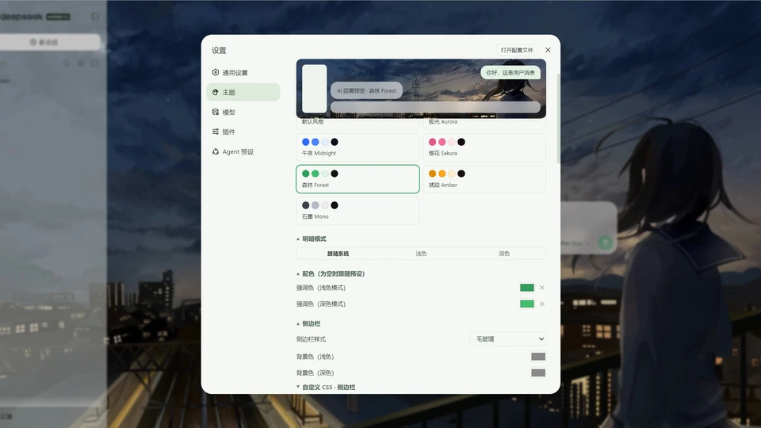</td>
<td align="center" valign="middle"><a href="https://github.com/X9wd09ncc/dsh-x9-theme">X9wd09ncc/dsh-x9-theme</a></td>
<td align="center" valign="middle">1</td>
</tr>
<tr>
<td align="center" valign="middle">dsh_Rhine_Lab_themo</td>
<td align="center" valign="middle">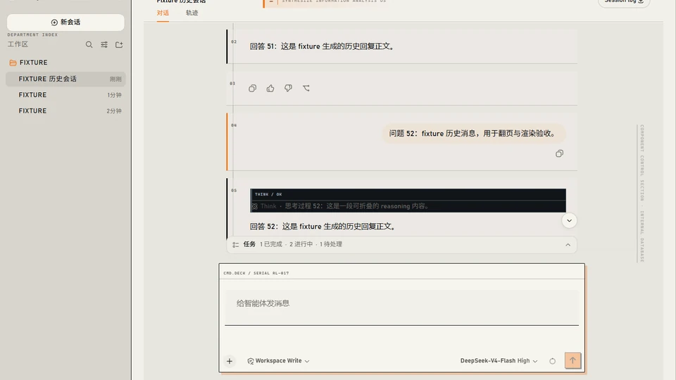</td>
<td align="center" valign="middle"><a href="https://github.com/ReLuckyLucy/dsh_Rhine_Lab_themo">ReLuckyLucy/dsh_Rhine_Lab_themo</a></td>
<td align="center" valign="middle">0</td>
</tr>
<tr>
<td align="center" valign="middle">dsh-815-skin</td>
<td align="center" valign="middle"></td>
<td align="center" valign="middle"><a href="https://github.com/lengduan/dsh-815-skin">lengduan/dsh-815-skin</a></td>
<td align="center" valign="middle">0</td>
</tr>
<tr>
<td align="center" valign="middle">dsh-anthropic-fonts</td>
<td align="center" valign="middle">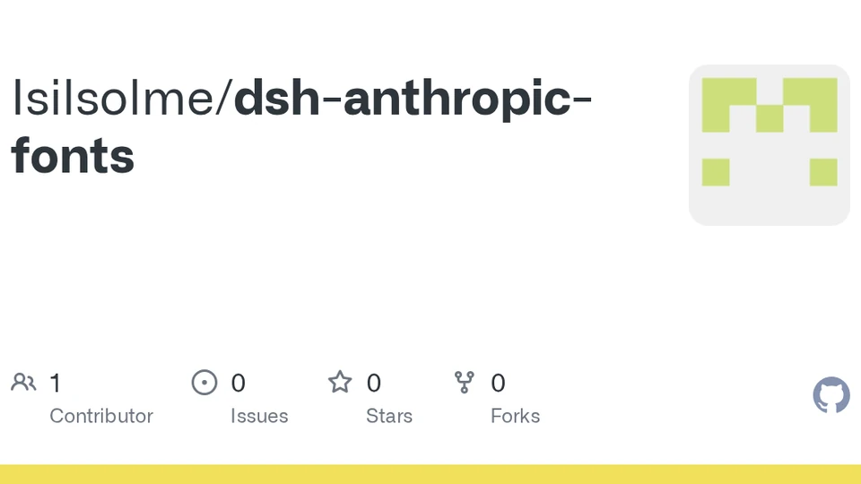</td>
<td align="center" valign="middle"><a href="https://github.com/Isilsolme/dsh-anthropic-fonts">Isilsolme/dsh-anthropic-fonts</a></td>
<td align="center" valign="middle">0</td>
</tr>
<tr>
<td align="center" valign="middle">dsh-aurora-theme</td>
<td align="center" valign="middle">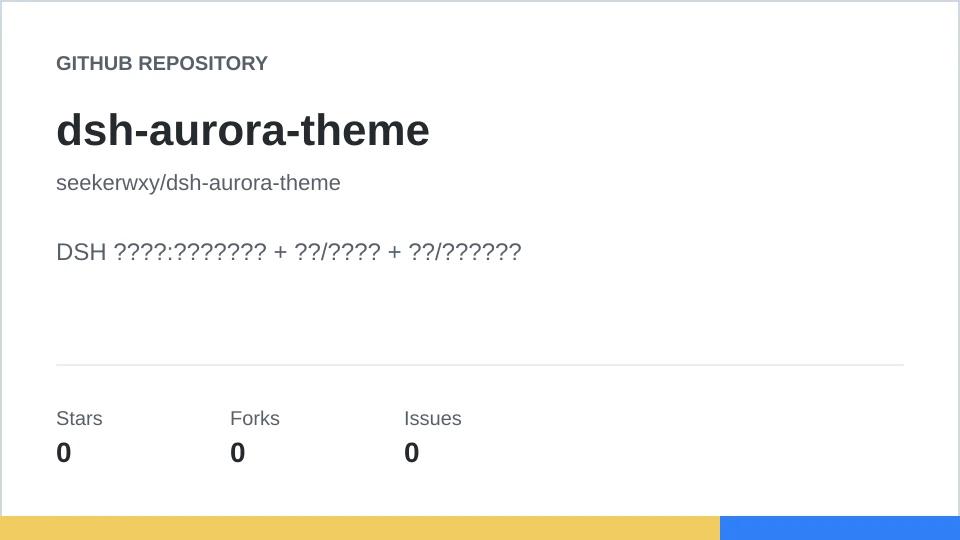</td>
<td align="center" valign="middle"><a href="https://github.com/seekerwxy/dsh-aurora-theme">seekerwxy/dsh-aurora-theme</a></td>
<td align="center" valign="middle">0</td>
</tr>
<tr>
<td align="center" valign="middle">dsh-fate-twin-contract</td>
<td align="center" valign="middle">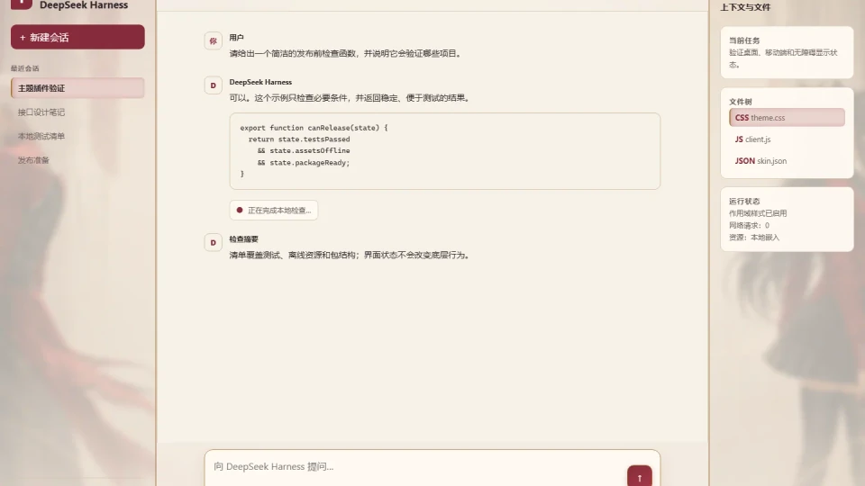</td>
<td align="center" valign="middle"><a href="https://github.com/Jayliu2025-vip/dsh-fate-twin-contract">Jayliu2025-vip/dsh-fate-twin-contract</a></td>
<td align="center" valign="middle">0</td>
</tr>
<tr>
<td align="center" valign="middle">dsh-fgo-chaldea</td>
<td align="center" valign="middle">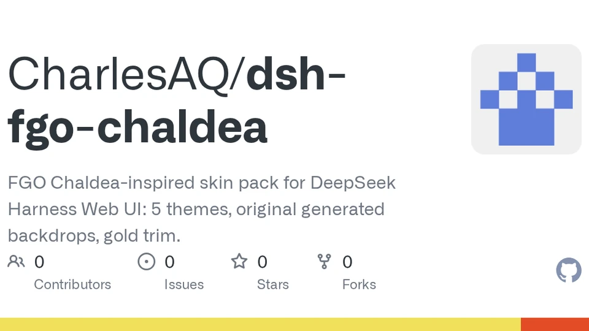</td>
<td align="center" valign="middle"><a href="https://github.com/CharlesAQ/dsh-fgo-chaldea">CharlesAQ/dsh-fgo-chaldea</a></td>
<td align="center" valign="middle">0</td>
</tr>
<tr>
<td align="center" valign="middle">dsh-file-explorer-preview-code</td>
<td align="center" valign="middle">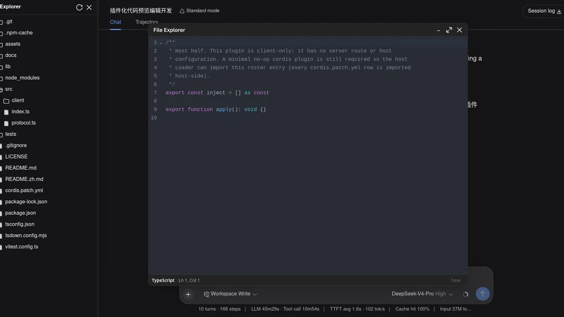</td>
<td align="center" valign="middle"><a href="https://github.com/wolfsonliu/dsh-file-explorer-preview-code">wolfsonliu/dsh-file-explorer-preview-code</a></td>
<td align="center" valign="middle">0</td>
</tr>
<tr>
<td align="center" valign="middle">dsh-Fonts</td>
<td align="center" valign="middle">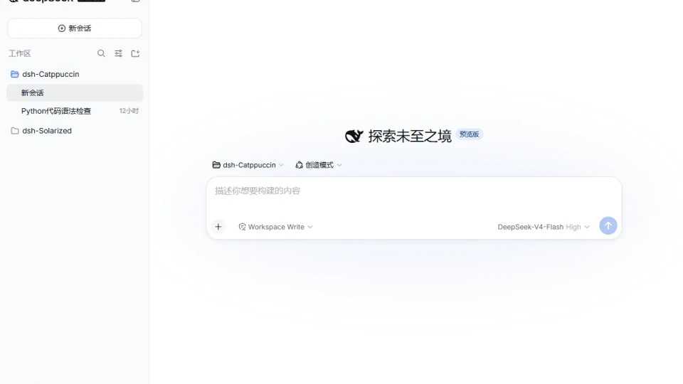</td>
<td align="center" valign="middle"><a href="https://github.com/zhijun-dai/dsh-Fonts">zhijun-dai/dsh-Fonts</a></td>
<td align="center" valign="middle">0</td>
</tr>
<tr>
<td align="center" valign="middle">dsh-glassic-mist-theme</td>
<td align="center" valign="middle">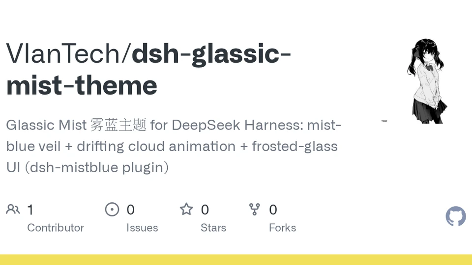</td>
<td align="center" valign="middle"><a href="https://github.com/VlanTech/dsh-glassic-mist-theme">VlanTech/dsh-glassic-mist-theme</a></td>
<td align="center" valign="middle">0</td>
</tr>
<tr>
<td align="center" valign="middle">dsh-nene-theme</td>
<td align="center" valign="middle">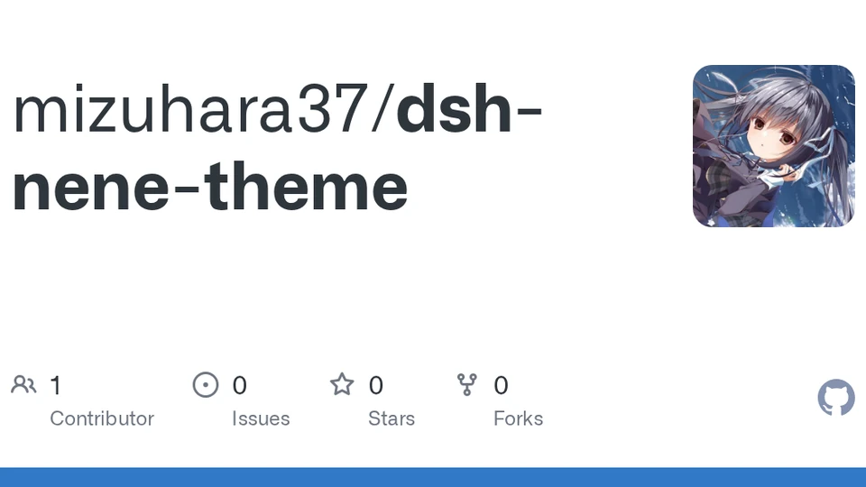</td>
<td align="center" valign="middle"><a href="https://github.com/mizuhara37/dsh-nene-theme">mizuhara37/dsh-nene-theme</a></td>
<td align="center" valign="middle">0</td>
</tr>
<tr>
<td align="center" valign="middle">dsh-palenight-theme</td>
<td align="center" valign="middle">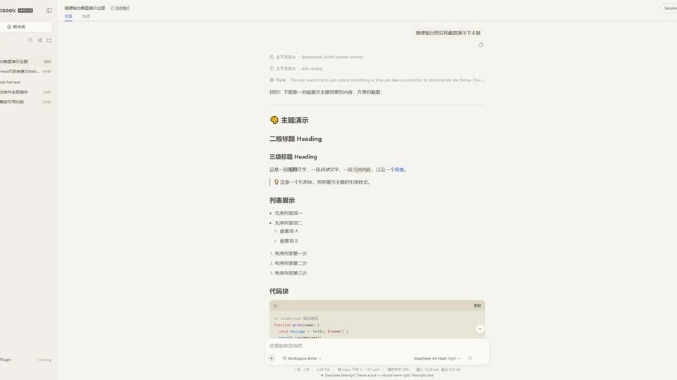</td>
<td align="center" valign="middle"><a href="https://github.com/youyli03/dsh-palenight-theme">youyli03/dsh-palenight-theme</a></td>
<td align="center" valign="middle">0</td>
</tr>
<tr>
<td align="center" valign="middle">dsh-pixel-skin</td>
<td align="center" valign="middle">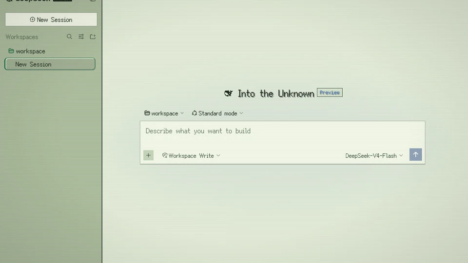</td>
<td align="center" valign="middle"><a href="https://github.com/ADAning/dsh-pixel-skin">ADAning/dsh-pixel-skin</a></td>
<td align="center" valign="middle">0</td>
</tr>
<tr>
<td align="center" valign="middle">dsh-pnc-theme</td>
<td align="center" valign="middle">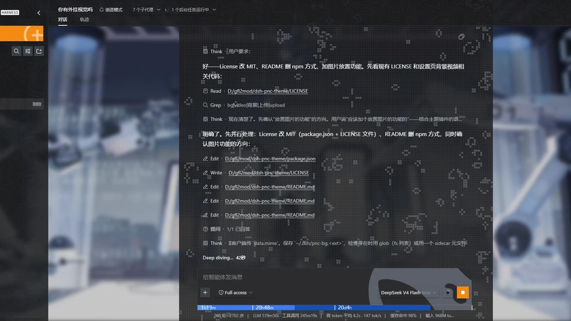</td>
<td align="center" valign="middle"><a href="https://github.com/Morinissleeping/dsh-pnc-theme">Morinissleeping/dsh-pnc-theme</a></td>
<td align="center" valign="middle">0</td>
</tr>
<tr>
<td align="center" valign="middle">dsh-premium-themes</td>
<td align="center" valign="middle">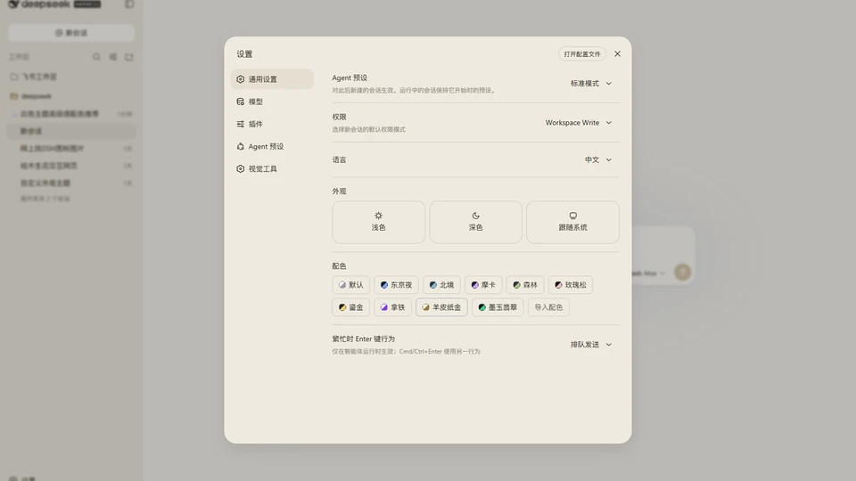</td>
<td align="center" valign="middle"><a href="https://github.com/xiaoyanzi191/dsh-premium-themes">xiaoyanzi191/dsh-premium-themes</a></td>
<td align="center" valign="middle">0</td>
</tr>
<tr>
<td align="center" valign="middle">dsh-skin-glass</td>
<td align="center" valign="middle">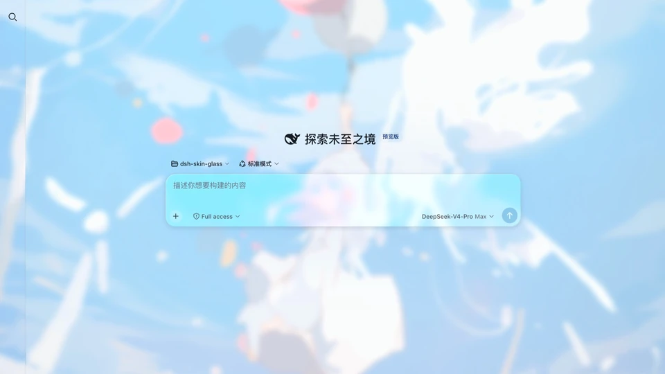</td>
<td align="center" valign="middle"><a href="https://github.com/noexcs/dsh-skin-glass">noexcs/dsh-skin-glass</a></td>
<td align="center" valign="middle">0</td>
</tr>
<tr>
<td align="center" valign="middle">dsh-skin-kamisato</td>
<td align="center" valign="middle">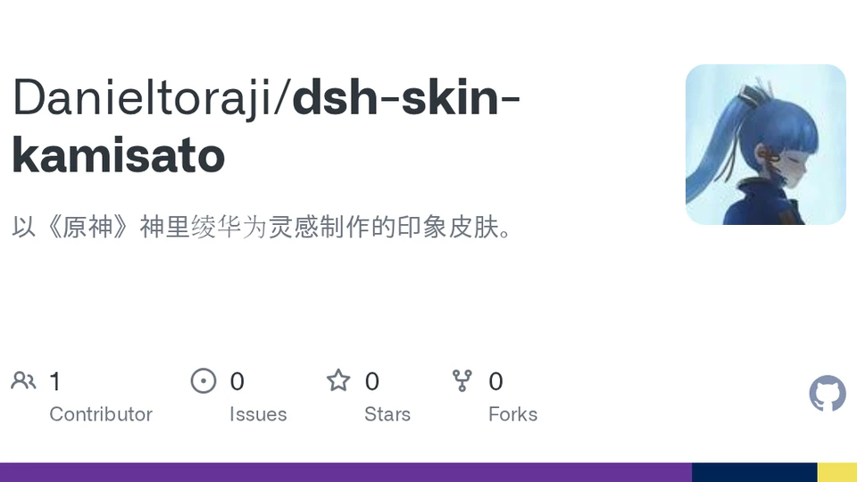</td>
<td align="center" valign="middle"><a href="https://github.com/Danieltoraji/dsh-skin-kamisato">Danieltoraji/dsh-skin-kamisato</a></td>
<td align="center" valign="middle">0</td>
</tr>
<tr>
<td align="center" valign="middle">dsh-skin-study</td>
<td align="center" valign="middle">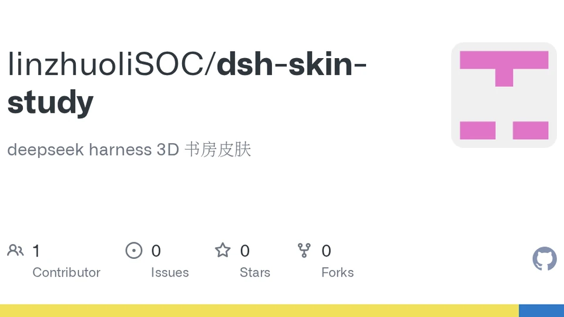</td>
<td align="center" valign="middle"><a href="https://github.com/linzhuoliSOC/dsh-skin-study">linzhuoliSOC/dsh-skin-study</a></td>
<td align="center" valign="middle">0</td>
</tr>
<tr>
<td align="center" valign="middle">dsh-stylevault</td>
<td align="center" valign="middle">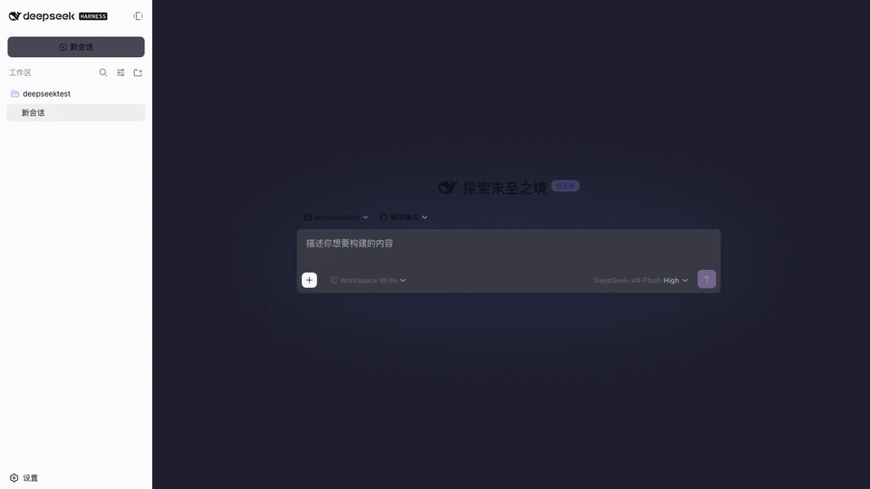</td>
<td align="center" valign="middle"><a href="https://github.com/GptsApp/dsh-stylevault">GptsApp/dsh-stylevault</a></td>
<td align="center" valign="middle">0</td>
</tr>
<tr>
<td align="center" valign="middle">dsh-task-console</td>
<td align="center" valign="middle">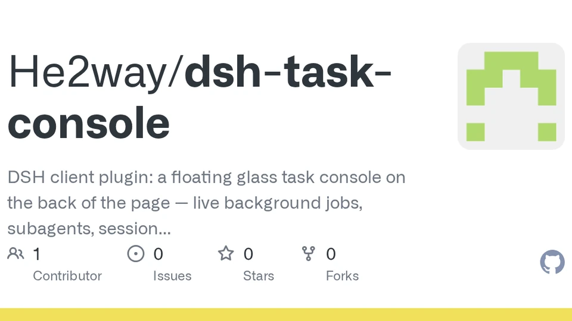</td>
<td align="center" valign="middle"><a href="https://github.com/He2way/dsh-task-console">He2way/dsh-task-console</a></td>
<td align="center" valign="middle">0</td>
</tr>
<tr>
<td align="center" valign="middle">dsh-theme-center</td>
<td align="center" valign="middle">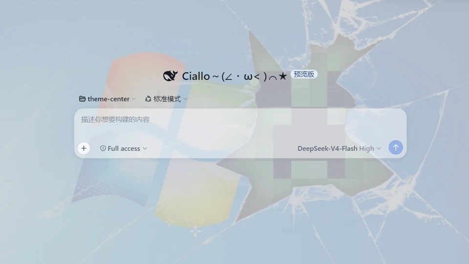</td>
<td align="center" valign="middle"><a href="https://github.com/dac114514/dsh-theme-center">dac114514/dsh-theme-center</a></td>
<td align="center" valign="middle">0</td>
</tr>
<tr>
<td align="center" valign="middle">dsh-theme-huluwa</td>
<td align="center" valign="middle">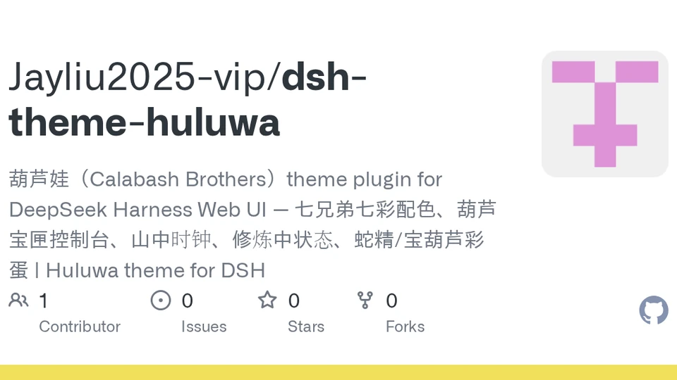</td>
<td align="center" valign="middle"><a href="https://github.com/Jayliu2025-vip/dsh-theme-huluwa">Jayliu2025-vip/dsh-theme-huluwa</a></td>
<td align="center" valign="middle">0</td>
</tr>
<tr>
<td align="center" valign="middle">dsh-theme-machine</td>
<td align="center" valign="middle">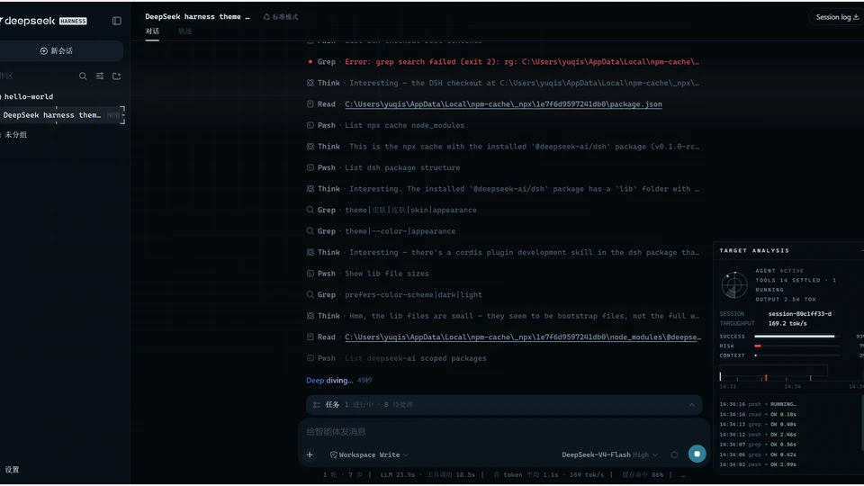</td>
<td align="center" valign="middle"><a href="https://github.com/yuqisun/dsh-theme-machine">yuqisun/dsh-theme-machine</a></td>
<td align="center" valign="middle">0</td>
</tr>
<tr>
<td align="center" valign="middle">dsh-wallpaper-rotator-enhanced</td>
<td align="center" valign="middle">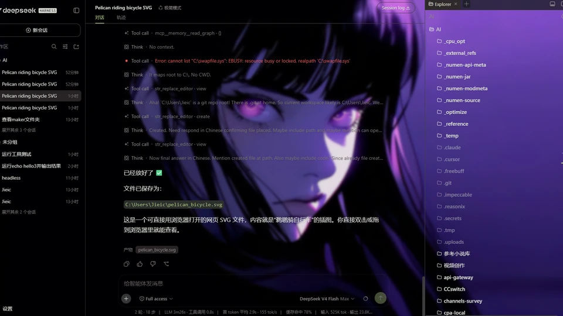</td>
<td align="center" valign="middle"><a href="https://github.com/Jieice/dsh-wallpaper-rotator-enhanced">Jieice/dsh-wallpaper-rotator-enhanced</a></td>
<td align="center" valign="middle">0</td>
</tr>
<tr>
<td align="center" valign="middle">dsh-weather-plugin</td>
<td align="center" valign="middle">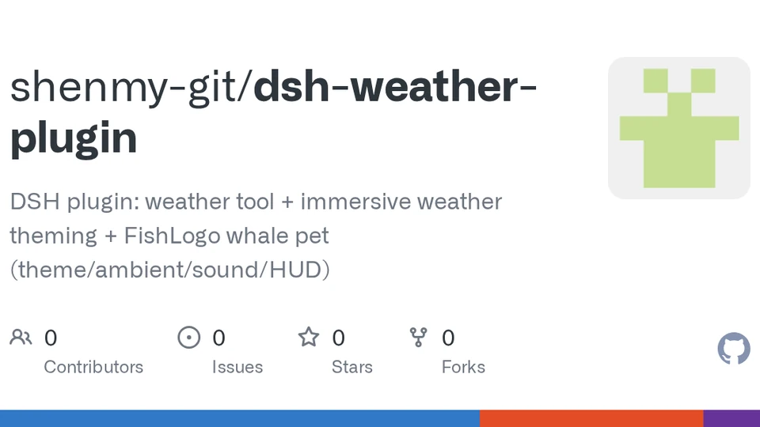</td>
<td align="center" valign="middle"><a href="https://github.com/shenmy-git/dsh-weather-plugin">shenmy-git/dsh-weather-plugin</a></td>
<td align="center" valign="middle">0</td>
</tr>
<tr>
<td align="center" valign="middle">dsh-wechat-skin</td>
<td align="center" valign="middle"></td>
<td align="center" valign="middle"><a href="https://github.com/licheng-ma/dsh-wechat-skin">licheng-ma/dsh-wechat-skin</a></td>
<td align="center" valign="middle">0</td>
</tr>
<tr>
<td align="center" valign="middle">dsh-whale-bg</td>
<td align="center" valign="middle"></td>
<td align="center" valign="middle"><a href="https://github.com/gooosie/dsh-whale-bg">gooosie/dsh-whale-bg</a></td>
<td align="center" valign="middle">0</td>
</tr>
<tr>
<td align="center" valign="middle">shuimo-skin</td>
<td align="center" valign="middle">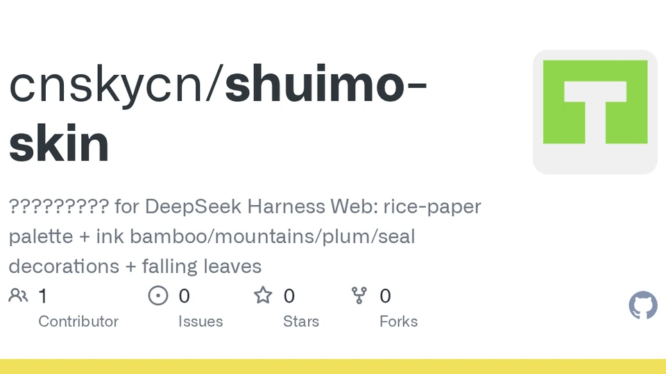</td>
<td align="center" valign="middle"><a href="https://github.com/cnskycn/shuimo-skin">cnskycn/shuimo-skin</a></td>
<td align="center" valign="middle">0</td>
</tr>
<tr>
<td align="center" valign="middle">wishadel-theme</td>
<td align="center" valign="middle">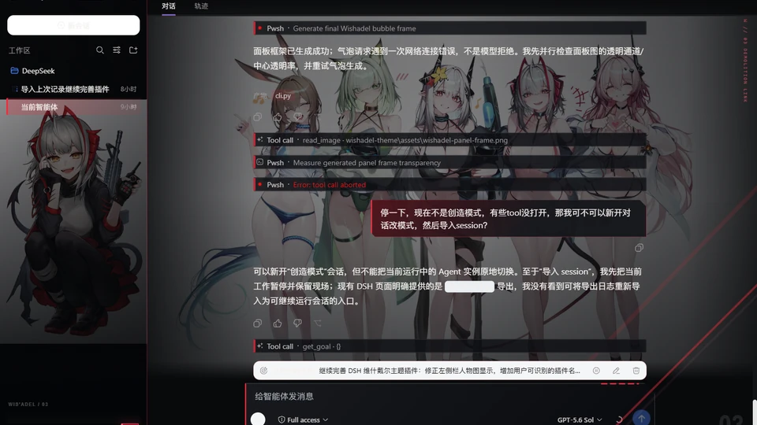</td>
<td align="center" valign="middle"><a href="https://github.com/cdxDNRF/wishadel-theme">cdxDNRF/wishadel-theme</a></td>
<td align="center" valign="middle">0</td>
</tr>
</tbody>
</table>
